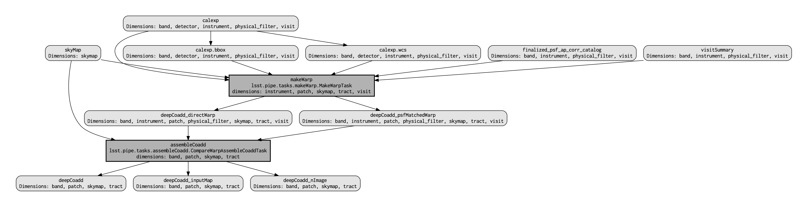

######################################################
02. Custom Coadds from the Command Line (intermediate)
######################################################

.. This section should provide a brief, top-level description of the page.

**Contact author:** Aaron Meisner

**Last verified to run:** 05/02/2023

**Targeted learning level:** Intermediate

**Container size:** large

**Credit:** This command line tutorial is based on the corresponding notebook tutorial by Melissa Graham. The command line approach is heavily influenced by Shenming Fu's recipe for reducing `DECam <https://noirlab.edu/science/programs/ctio/instruments/Dark-Energy-Camera>`_ data with the Gen3 LSST Science Pipelines, which is in turn based on `Lee Kelvin's Merian processing instructions <https://hackmd.io/@lsk/merian>`_.

**Introduction:** 
This tutorial shows how to use command line ``pipetask`` invocations to produce custom coadds from simulated single-exposure Rubin/LSST images. It is meant to parallel the corresponding Jupyter Notebook tutorial entitled `Construct a Custom Coadded Image <https://github.com/rubin-dp0/tutorial-notebooks/blob/main/09_Custom_Coadds/09a_Custom_Coadd.ipynb>`_.

The peak memory of this custom coadd processing is between 8 and 9 GB, hence a large container is necessary.

This tutorial uses the Data Preview 0.2 (DP0.2) data set.
This data set uses a subset of the DESC's Data Challenge 2 (DC2) simulated images, which have been reprocessed by Rubin Observatory using Version 23 of the LSST Science Pipelines.
More information about the simulated data can be found in the DESC's `DC2 paper <https://ui.adsabs.harvard.edu/abs/2021ApJS..253...31L/abstract>`_ and in the `DP0.2 data release documentation <https://dp0-2.lsst.io>`_.

**WARNING:
This custom coadd tutorial will only run with LSST Science Pipelines version Weekly 2022_40.**

To find out which version of the LSST Science Pipelines you are using, look in the footer bar.

If you are using ``w_2022_40``, you may proceed with executing the custom coadd notebooks.

If you are **not** using ``w_2022_40`` you **must** log out and start a new server:
 1. At top left in the menu bar choose File then Save All and Exit.
 2. Re-enter the Notebook Aspect.
 3. At `the "Server Options" stage <https://dp0-2.lsst.io/data-access-analysis-tools/nb-intro.html#how-to-log-in-navigate-and-log-out-of-jupyterlab>`_, under "Select uncached image (slower start)" choose ``w_2022_40``.
 4. Note that it might take a few minutes to start your server with an old image.

**Why do I need to use an old image for this tutorial?**
In this tutorial and in the future with real LSST data, users will be able to recreate coadds starting with intermediate data products (the `warps <https://pipelines.lsst.io/getting-started/coaddition.html?highlight=warp#warping-images-onto-the-skymap>`_).
On Feb 16 2023, as documented in the `Major Updates Log <https://dp0-2.lsst.io/tutorials-examples/major-updates-log.html#major-updates-log>`_ for DP0.2 tutorials, the recommended image of the RSP at `data.lsst.cloud <https://data.lsst.cloud/>`_ was bumped from Weekly 2022_40 to Weekly 2023_07.
However, the latest versions of the pipelines are not compatible with the intermediate data products of DP0.2, which were produced in early 2022.
To update this tutorial to be able to use Weekly 2023_07, it would have to demonstrate how to recreate coadds *starting with the raw data products*.
This is pedagogically undesirable because it does not accurately represent *future workflows*, which is the goal of DP0.2.
Thus, it is recommended that delegates learn how to recreate coadds with Weekly 2022_40.

Step 1. Access the terminal and setup
=====================================

1.0. Recall the scientific context motivating custom coadds

A (hypothetical) supernova went off at (RA, Dec) = (55.745834, -32.269167) degrees on MJD = 60960. You wish to make a custom coadd of input DESC DC2 simulated exposures corresponding to a specific MJD range, nicknamed "Window1": 60925 < MJD < 60955, roughly the month leading up to the explosion. The science goal is to search for any potential supernova precursor in the pre-explosion imaging, without contamination by the post-explosion transient.

1.1. Log in to the Notebook Aspect. The terminal is a subcomponent of the Notebook Aspect.

1.2. In the launcher window under "Other", select the terminal.

1.3. Set up the Rubin Observatory environment.

.. code-block::

    setup lsst_distrib
    
1.4. Perform a command line verification that you are using the correct ``w_2022_40`` version of the LSST Science Pipelines.

.. code-block::

     eups list lsst_distrib
     g0b29ad24fb+9b30730ed8       current w_2022_40 setup

Step 2. Build your custom coaddition pipeline
=============================================

As you saw in tutorial notebook 9b, you do not need to rerun the entire DP0.2 data processing in order to obtain custom coadds. You only need to run a subset of the tasks that make up ``step3`` of the DP0.2 processing, where ``step3`` refers to coadd-level processing. Specifically, you want to rerun only the ``makeWarp`` and ``assembleCoadd`` tasks.

The strategy for running these custom coadds via the command line is to start with the "Data Release Production" (DRP) pipeline used for DP0.2 processing and make relatively minor edits to isolate the specific ``makeWarp`` and ``assembleCoadd`` tasks of interest.

2.1. Inspect the DP0.2 YAML pipeline definition

Let's start by taking a look at the DRP pipeline YAML pipeline definition file for DP0.2. As mentioned in notebook `tutorial 9a <https://github.com/rubin-dp0/tutorial-notebooks/blob/main/09_Custom_Coadds/09a_Custom_Coadd.ipynb>`_, this can be viewed from within the Rubin Science Platform (RSP) at ``$DRP_PIPE_DIR/ingredients/LSSTCam-imSim/DRP.yaml``. There are multiple ways to view an `ASCII <https://en.wikipedia.org/wiki/ASCII>`_ (plain text) file such as ``DRP.yaml`` from a Linux terminal. Let's use a program called `head <https://en.wikipedia.org/wiki/Head_(Unix)>`_.

.. code-block::

    head -143 $DRP_PIPE_DIR/ingredients/LSSTCam-imSim/DRP.yaml
    description: DRP specialized for ImSim-DC2 data
    instrument: lsst.obs.lsst.LsstCamImSim
    imports:
      - $DRP_PIPE_DIR/ingredients/DRP-minimal-calibration.yaml
      - $FARO_DIR/pipelines/metrics_pipeline.yaml
    tasks:
      isr:
        class: lsst.ip.isr.IsrTask
        config:
          connections.newBFKernel: bfk
          doDefect: false
          doBrighterFatter: true
      calibrate:
        class: lsst.pipe.tasks.calibrate.CalibrateTask
        config:
          connections.astromRefCat: "cal_ref_cat_2_2"
          connections.photoRefCat: "cal_ref_cat_2_2"
          python: >
            config.astromRefObjLoader.filterMap = {band: 'lsst_%s_smeared' % (band) for band in 'ugrizy'};
            config.photoRefObjLoader.filterMap = {band: 'lsst_%s_smeared' % (band) for band in 'ugrizy'};
      measure:
        class: lsst.pipe.tasks.multiBand.MeasureMergedCoaddSourcesTask
        config:
          connections.refCat: "cal_ref_cat_2_2"
          python: >
            config.match.refObjLoader.filterMap = {band: 'lsst_%s_smeared' % (band) for band in 'ugrizy'};
      matchObjectToTruth:
        class: lsst.pipe.tasks.match_tract_catalog.MatchTractCatalogTask
        config:
          python: |
            # Target settings are likely common to all object tables
            from lsst.pipe.tasks.match_tract_catalog_probabilistic import MatchTractCatalogProbabilisticTask
            config.match_tract_catalog.retarget(MatchTractCatalogProbabilisticTask)
            config.match_tract_catalog.columns_ref_flux = [
                'flux_u', 'flux_g', 'flux_r',
                'flux_i', 'flux_z', 'flux_y',
            ]
            config.match_tract_catalog.columns_ref_meas = [
                'ra', 'dec',
                'flux_u', 'flux_g', 'flux_r',
                'flux_i', 'flux_z', 'flux_y',
            ]
            config.match_tract_catalog.columns_target_meas = [
                'x', 'y',
                'u_cModelFlux', 'g_cModelFlux', 'r_cModelFlux',
                'i_cModelFlux', 'z_cModelFlux', 'y_cModelFlux',
            ]
            config.match_tract_catalog.columns_target_err = [
                'xErr', 'yErr',
                'u_cModelFluxErr', 'g_cModelFluxErr', 'r_cModelFluxErr',
                'i_cModelFluxErr', 'z_cModelFluxErr', 'y_cModelFluxErr',
            ]
            config.match_tract_catalog.coord_format.coords_ref_to_convert = {'ra': 'x', 'dec': 'y'}
            # Might need adjusting for different survey depths
            config.match_tract_catalog.mag_faintest_ref = 27.0
            config.match_tract_catalog.columns_ref_copy = ['id']
            config.match_tract_catalog.columns_target_copy = ['objectId']
      compareObjectToTruth:
        class: lsst.pipe.tasks.diff_matched_tract_catalog.DiffMatchedTractCatalogTask
        config:
          columns_target_coord_err: ['xErr', 'yErr']
          coord_format.coords_ref_to_convert: {'ra': 'x', 'dec': 'y'}
    
          python: |
            from lsst.pipe.tasks.diff_matched_tract_catalog import MatchedCatalogFluxesConfig
            columns_flux = {}
            for band in 'ugrizy':
                columns_flux[band] = MatchedCatalogFluxesConfig(
                    column_ref_flux=f'flux_{band}',
                    columns_target_flux=[f'{band}_cModelFlux',],
                    columns_target_flux_err=[f'{band}_cModelFluxErr',],
                )
            config.columns_flux = columns_flux
    subsets:
      step1:
        subset:
          - isr
          - characterizeImage
          - calibrate
          - writeSourceTable
          - transformSourceTable
        description: |
          Per-detector tasks that can be run together to start the DRP pipeline.
    
          These may or may not be run with 'tract' or 'patch' as part of the data
          ID expression. This specific pipeline contains no tasks that require full
          visits. Running with 'tract' (and 'patch') constraints will select
          partial visits that overlap that region.
    
          In data release processing, operators should stop to address unexpected
          failures before continuing on to step2.
      step2:
        subset:
          - consolidateSourceTable
          - consolidateVisitSummary
          - isolatedStarAssociation
          - finalizeCharacterization
          - makeCcdVisitTable
          - makeVisitTable
        description: |
          Tasks that can be run together, but only after the 'step1'.
    
          This is a mix of visit-level, tract-level, and collection-level tasks
          that must not be run with any data query constraints other than
          instrument. For example, running with 'tract' (and 'patch') constraints
          will select partial visits that overlap that region.
    
          Visit-level tasks include consolidateSourceTable, consolidateVisitSummary,
          finalizeCharacterization.
          Tract-level tasks include: isolatedStarAssociation
          Full collection-level tasks include: makeCcdVisitTable, makeVisitTable
      step3:
        subset:
          - makeWarp
          - assembleCoadd
          - detection
          - mergeDetections
          - deblend
          - measure
          - mergeMeasurements
          - forcedPhotCoadd
          - transformObjectTable
          - writeObjectTable
          - consolidateObjectTable
          - healSparsePropertyMaps
          - selectGoodSeeingVisits
          - templateGen
        description: |
          Tasks that can be run together, but only after the 'step1' and 'step2'
          subsets.
    
          These should be run with explicit 'tract' constraints essentially all the
          time, because otherwise quanta will be created for jobs with only partial
          visit coverage.
    
          It is expected that many forcedPhotCcd quanta will "normally" fail when
          running this subset, but this isn't a problem right now because there are
          no tasks downstream of it.  If other tasks regularly fail or we add tasks
          downstream of forcedPhotCcd, these subsets or the tasks will need
          additional changes.
    
          This subset is considered a workaround for missing middleware and task
          functionality.  It may be removed in the future.

``head -143`` is used to only show the first 143 (of > 250 total) lines of the file, as the later pipeline stages toward the end of the YAML file are not relevant for this tutorial.

2.2. Edit the YAML pipeline definition for making custom coadds

That's a lot of pipeline definition YAML! Luckily, it's only necessary for your purposes to be concerned with the ``step3`` (coadd-level processing) portion of the pipeline definition, which is shown below.

.. code-block::

      step3:
        subset:
          - makeWarp
          - assembleCoadd
          - detection
          - mergeDetections
          - deblend
          - measure
          - mergeMeasurements
          - forcedPhotCoadd
          - transformObjectTable
          - writeObjectTable
          - consolidateObjectTable
          - healSparsePropertyMaps
          - selectGoodSeeingVisits
          - templateGen

Ensure that you're in the working directory on RSP that you've chosen to be the place from which you will run the custom coadd processing. It is somewhat of a convention to put pipeline configuration files in a subdirectory named `config`. So let's make that `config` subdirectory:

.. code-block::

    mkdir config
    
Let's not modify the original ``$DRP_PIPE_DIR/ingredients/LSSTCam-imSim/DRP.yaml`` file in place, but rather bring in a copy to the newly made `config` directory. You will then edit this copy to customize it for the desired coaddition.

.. code-block::

    cp $DRP_PIPE_DIR/ingredients/LSSTCam-imSim/DRP.yaml config/makeWarpAssembleCoadd.yaml
    
Note that in doing this copy you've given the resulting file a name of ``makeWarpAssembleCoadd.yaml``, which better reflects its purpose than would simply ``DRP.yaml``.

Now let's edit your ``config/makeWarpAssembleCoadd.yaml`` pipeline definition file. There are multiple ways to edit a text file in a Linux environment, such as `nano <https://www.nano-editor.org/>`_, `emacs <https://www.gnu.org/software/emacs/>`_, and `vim <https://www.vim.org/>`_, all of which are available to you at the RSP terminal.

Using whichever text editor option you prefer, edit the ``step3`` section of ``config/makeWarpAssembleCoadd.yaml`` so that only the ``makeWarp`` and ``assembleCoadd`` tasks remain:

.. code-block::

      step3:
        subset:
          - makeWarp
          - assembleCoadd

Make sure to save your changes when you exit the text editor! Also make sure that you did not change any of the indentation in the ``config/makeWarpAssembleCoadd.yaml`` file, for the lines that remain.

To arrive at the above ``step3`` YAML, you should have deleted exactly 12 lines worth of YAML tasks from the material originally contained in ``config/makeWarpAssembleCoadd.yaml``. You can check exactly what you changed using the Linux command ``diff``, which prints out the difference between two files. The following shows the expected ``diff`` results for proper editing of the YAML pipeline definition:

.. code-block::

    diff $DRP_PIPE_DIR/ingredients/LSSTCam-imSim/DRP.yaml config/makeWarpAssembleCoadd.yaml 
    116,127d115
    <       - detection
    <       - mergeDetections
    <       - deblend
    <       - measure
    <       - mergeMeasurements
    <       - forcedPhotCoadd
    <       - transformObjectTable
    <       - writeObjectTable
    <       - consolidateObjectTable
    <       - healSparsePropertyMaps
    <       - selectGoodSeeingVisits
    <       - templateGen

The lines starting with ``<`` symbols indicate lines that were deleted from ``config/makeWarpAssembleCoadd.yaml``. Now you're ready to start running some ``pipetask`` commands at the terminal.

Step 3. Show your pipeline and its configurations
=================================================

3.1 Choose an output collection name/location

.. probably want to change where this appears relative to other items, figure out later

Some of the ``pipetask`` commands later in this tutorial require you to specify an output collection where your new coadds will eventually be written to. As described in the notebook version of `tutorial 9a <https://github.com/rubin-dp0/tutorial-notebooks/blob/main/09_Custom_Coadds/09a_Custom_Coadd.ipynb>`_, you want to name your output collection as something like ``u/<Your User Name>/<Collection Identifier>``. As an concrete example, throughout the rest of this tutorial ``u/ameisner/custom_coadd_window1_cl00`` is used as the collection name.

3.2 Build your custom-defined pipeline

`pipetask <https://pipelines.lsst.io/modules/lsst.ctrl.mpexec/pipetask.html>`_ commands are provided as part of the LSST Science Pipelines software stack and are used to build, visualize, and run processing pipelines from the terminal. Let's not jump straight into running the pipeline, but rather start by checking whether the pipeline will first ``build``. To ``build`` a pipeline, you use a command starting with ``pipetask build`` and specify an argument telling ``pipetask`` which specific YAML pipeline definition file you want it to build. If there are syntax or other errors in the YAML file's pipeline definition, then ``pipetask build`` will fail with an error about the problem. If ``pipetask build`` succeeds, it will run without generating errors and print a YAML version of the pipeline to `standard output <https://en.wikipedia.org/wiki/Standard_streams#Standard_output_(stdout)>`_. Here is the exact syntax:

.. code-block::

    pipetask build \
    -p config/makeWarpAssembleCoadd.yaml#step3 \
    --show pipeline
    
This is all one single terminal (shell) command, but spread out over three input lines using ``\`` for line continuation. It would be entirely equivalent to run:

.. code-block::

    pipetask build -p config/makeWarpAssembleCoadd.yaml#step3 --show pipeline
    
The ``-p`` parameter of ``pipetask`` is short for ``--pipeline`` and it is critical that this parameter be specified as the new ``config/makeWarpAssembleCoadd.yaml`` file made in section 2.2. It is also critical that the ``-p`` argument contain the string ``#step3`` appended at the end of the config file name. This is because you want to only run the coaddition step to make custom coadds. Here's what running the command, and its output should look like:

.. code-block::

    pipetask build -p config/makeWarpAssembleCoadd.yaml#step3 --show pipeline
    description: DRP specialized for ImSim-DC2 data
    instrument: lsst.obs.lsst.LsstCamImSim
    tasks:
      makeWarp:
        class: lsst.pipe.tasks.makeWarp.MakeWarpTask
        config:
        - makePsfMatched: true
      assembleCoadd:
        class: lsst.pipe.tasks.assembleCoadd.CompareWarpAssembleCoaddTask
        config:
        - doInputMap: true
    subsets:
      step3:
        subset:
        - makeWarp
        - assembleCoadd
        description: |
          Tasks that can be run together, but only after the 'step1' and 'step2'
          subsets.
    
          These should be run with explicit 'tract' constraints essentially all the
          time, because otherwise quanta will be created for jobs with only partial
          visit coverage.
    
          It is expected that many forcedPhotCcd quanta will "normally" fail when
          running this subset, but this isn't a problem right now because there are
          no tasks downstream of it.  If other tasks regularly fail or we add tasks
          downstream of forcedPhotCcd, these subsets or the tasks will need
          additional changes.
    
          This subset is considered a workaround for missing middleware and task
          functionality.  It may be removed in the future.

``pipetask --help`` provides a bunch of documentation about ``pipetask``.

3.3 Customize and inspect the coaddition configurations

As mentioned in `tutorial notebook 9a <https://github.com/rubin-dp0/tutorial-notebooks/blob/main/09_Custom_Coadds/09a_Custom_Coadd.ipynb>`_, there are a couple of specific coaddition configuration parameters that need to be set in order to accomplish the desired custom coaddition. In detail, two ``makeWarp`` task needs two of its configuration parameters configured: ``doApplyFinalizedPsf`` and ``connections.visitSummary``. First, let's try an experiment of simply finding out what the default value of ``doApplyFinalizedPsf``, so that you can appreciate the results of having modified this parameteter later on. To view the configuration parameters, you need to use a ``pipetask run`` command, not a ``pipetask build`` command. The command used is shown here, and will be explained below:

.. code-block::

    pipetask run \
    -b dp02 \
    -p config/makeWarpAssembleCoadd.yaml#step3 \
    --show config=makeWarp::doApplyFinalizedPsf
    
Notice that the ``-p`` parameter passed to ``pipetask`` has remained the same. But in order for ``pipetask run`` to operate, it also needs to know what Butler repository it's dealing with. That's why the `-b dp02` argument has been added. `dp02` is an alias that points to the S3 location of the DP0.2 Butler repository.

The final line merits further explanation. ``--show config`` tells the LSST pipelines not to actually run the pipeline, but rather to only show the configuration parameters, so that you can understand all the detailed choices being made by your processing, if desired. The last line would be valid as simply ``--show config``. However, this would print out every single configuration parameter and its description -- more than 1300 lines of printouts in total! Appending ``=<Task>::<Parameter>`` to ``--show config`` specifies exactly which parameter you want to be shown. In this case, it's known from `tutorial notebook 9a <https://github.com/rubin-dp0/tutorial-notebooks/blob/main/09_Custom_Coadds/09a_Custom_Coadd.ipynb>`_ that you want to adjust the ``doApplyFinalizedPsf`` parameter of the ``makeWarp`` Task, hence why ``makeWarp::doApplyFinalizedPsf`` is appended to ``--show config``.

Now let's look at what happens when you run the above ``pipetask command``:

.. code-block::

    pipetask run \
    > -b dp02 \
    > -p config/makeWarpAssembleCoadd.yaml#step3 \
    > --show config=makeWarp::doApplyFinalizedPsf
    Matching "doApplyFinalizedPsf" without regard to case (append :NOIGNORECASE to prevent this)
    ### Configuration for task `makeWarp'
    # Whether to apply finalized psf models and aperture correction map.
    config.doApplyFinalizedPsf=True
    No quantum graph generated or pipeline executed. The --show option was given and all options were processed.
    
Ignore the lines about "No quantum graph" and "NOIGNORECASE" -- for the present purposes, these can be considered non-fatal warnings. The line that starts with ``###`` specificies that ``pipetask run`` is showing us a parameter of the ``makeWarp`` Task (as opposed to some other task, like ``assembleCoadd``). The line that starts with ``#`` provides the plain English description of the parameter that you requested to be shown. The line following the plain English description of ``doApplyFinalizedPsf`` shows this parameter's default value, which is a boolean equal to ``True``. From `tutorial notebook 9a <https://github.com/rubin-dp0/tutorial-notebooks/blob/main/09_Custom_Coadds/09a_Custom_Coadd.ipynb>`_, you know that it's necessary to change ``doApplyFinalizedPsf`` to ``False`` i.e., the opposite of its default value. Let's see how this plays out in practice. The following modified ``pipetask run`` command adds one extra input parameter for the custom ``doApplyFinalizedPsf`` setting:

.. code-block::

    pipetask run \
    -b dp02 \
    -p config/makeWarpAssembleCoadd.yaml#step3 \
    -c makeWarp:doApplyFinalizedPsf=False \
    --show config=makeWarp::doApplyFinalizedPsf
    
The penultimate line (``-c makeWarp:doApplyFinalizedPsf=False \``) is newly added. The ``-c`` parameter of ``pipetask run`` (note the lower case ``c``) can be used to specify a desired value of a given parameter, with argument syntax of ``<Task>:<Parameter>=<Value>``. In this case, the Task is ``makeWarp``, the parameter is ``doApplyFinalizedPsf``, and the desired value is ``False``. Now find out if you succeeded in changing the configuration, by looking at the printouts generated from running the above command:

.. code-block::

    pipetask run \
    > -b dp02 \
    > -p config/makeWarpAssembleCoadd.yaml#step3 \
    > -c makeWarp:doApplyFinalizedPsf=False \
    > --show config=makeWarp::doApplyFinalizedPsf
    Matching "doApplyFinalizedPsf" without regard to case (append :NOIGNORECASE to prevent this)
    ### Configuration for task `makeWarp'
    # Whether to apply finalized psf models and aperture correction map.
    config.doApplyFinalizedPsf=False

    No quantum graph generated or pipeline executed. The --show option was given and all options were processed.
    
Notice that the printed configuration parameter value is indeed ``False`` i.e., not the default value...great! The second configuration parameter that you need to change can be passed to ``pipetask run`` in the exact same way, by simply adding a second ``-c`` argument whose line in the full shell command would look like

.. code-block::

    -c makeWarp:connections.visitSummary="visitSummary" \
    
Step 3. Explore and Visualize the QuantumGraph
==============================================

Before actually deploying the custom coaddition, let's take some time to understand the ``QuantumGraph`` of the processing to be run. The ``QuantumGraph`` is a tool used by the LSST Science Pipelines to break a large processing into relatively "bite-sized" ``quanta`` and arrange these quanta into a sequence such that all inputs needed by a given ``quantum`` are available for the execution of that ``quantum``. In the present case, you will not be doing an especially large processing, but for production deployments it makes sense to inspect and validate the ``QuantumGraph`` before proceeding straight to full-scale processing launch. It is a valuable practice to validate your ``QuantumGraph`` before generating a bunch of outputs.

So far, you've seen ``pipetask build`` and ``pipetask run``. For the ``QuantumGraph``, you'll use another ``pipetask`` variant, ``pipetask qgraph``. ``pipetask qgraph`` determines the full list of ``quanta`` that your processing will entail, so at this stage its important to bring in the query constraints that specify what subset of DP0.2 will be analyzed. This information is already available from `notebook tutorial 9a <https://github.com/rubin-dp0/tutorial-notebooks/blob/main/09_Custom_Coadds/09a_Custom_Coadd.ipynb>`_. In detail, you want to make a coadd only for ``patch=4431``, ``tract=17`` of the ``DC2`` ``skyMap``, and only using a particular set of 6 input exposures drawn from a desired temporal interval (``visit`` = 919515, 924057, 924085, 924086, 929477, 930353). `Tutorial notebook 9a <https://github.com/rubin-dp0/tutorial-notebooks/blob/main/09_Custom_Coadds/09a_Custom_Coadd.ipynb>`_ also provides a translation of these constraints into Butler query syntax as:

.. code-block::

    tract = 4431 AND patch = 17 AND visit in (919515,924057,924085,924086,929477,930353) AND skymap = 'DC2'
    
3.1 How many ``quanta``?

`Tutorial notebook 9a <https://github.com/rubin-dp0/tutorial-notebooks/blob/main/09_Custom_Coadds/09a_Custom_Coadd.ipynb>`_ shows that the desired custom coaddition entails executing 7 ``quanta`` (6 for ``makeWarp`` -- one per input exposure -- plus one for ``assembleCoadd``). Hopefully the command line version of this processing has the same number (and list) of ``quanta``! Let's check. Here's the ``pipetask qgraph`` command to use:

.. code-block::

    pipetask qgraph \
    -b dp02 \
    -i 2.2i/runs/DP0.2 \
    -p config/makeWarpAssembleCoadd.yaml#step3 \
    -c makeWarp:doApplyFinalizedPsf=False \
    -c makeWarp:connections.visitSummary="visitSummary" \
    -d "tract = 4431 AND patch = 17 AND visit in (919515,924057,924085,924086,929477,930353) AND skymap = 'DC2'"
    
Note a few things about this command:

* the command starts out with ``pipetask qgraph`` rather than ``pipetask run`` or ``pipetask build``.

* the input data set ``collection`` within DP0.2 is specified via the argument ``-i 2.2i/runs/DP0.2``. It's necessary to know about the input ``collection`` in order for ``pipetask`` and Butler to figure out how many (and which) ``quanta`` are expected.

* The same custom pipeline as always is specified, ``-p config/makeWarpAssembleCoadd.yaml#step3 \``.

* ``-c`` is used twice, to override the default configuration parameter settings for both ``doApplyFinalizedPsf=False`` and ``connections.visitSummary``.

* The query string has speen specified via the `-d` argument of ``pipetask``. Including this query constraint is really important -- without it, Butler and ``pipetask`` might try to figure out the (huge) list of ``quanta`` for custom coaddition of the entire DP0.2 data set.

Let's run this first ``pipetask qgraph`` command. Be aware that this takes approximately 15 minutes to run:

.. code-block::

    pipetask qgraph \
    > -b dp02 \
    > -i 2.2i/runs/DP0.2 \
    > -p config/makeWarpAssembleCoadd.yaml#step3 \
    > -c makeWarp:doApplyFinalizedPsf=False \
    > -c makeWarp:connections.visitSummary="visitSummary" \
    > -d "tract = 4431 AND patch = 17 AND visit in (919515,924057,924085,924086,929477,930353) AND skymap = 'DC2'"
    lsst.ctrl.mpexec.cmdLineFwk INFO: QuantumGraph contains 7 quanta for 2 tasks, graph ID: '1682993535.1936796-972'
    
There is only one printed line of output, which tells us that there are 7 ``quanta`` for 2 ``Tasks``, both of which make sense and match with what was found in `tutorial notebook 9a <https://github.com/rubin-dp0/tutorial-notebooks/blob/main/09_Custom_Coadds/09a_Custom_Coadd.ipynb>`_.

3.2 What are the ``quanta``?

It might be a little more satisfying to know the fully detailed list of 7 ``quanta``, rather than merely finding out that there are 7 ``quanta``. Thankfully, you can find out full details about the 7 quanta with only a slightly modified version of the previous ``pipetask qgraph`` command. Simply add another line to the command with ``--show graph``:

.. code-block::

    pipetask qgraph \
    -b dp02 \
    -i 2.2i/runs/DP0.2 \
    -p config/makeWarpAssembleCoadd.yaml#step3 \
    -c makeWarp:doApplyFinalizedPsf=False \
    -c makeWarp:connections.visitSummary="visitSummary" \
    -d "tract = 4431 AND patch = 17 AND visit in (919515,924057,924085,924086,929477,930353) AND skymap = 'DC2'" \
    --show graph
    
Like the previous ``pipetask qgraph``, this command also takes roughly 15 minutes to run. The ``--show graph`` variant produces dramatically more printouts, because it is telling you about all of the inputs and outputs of each ``quantum``:

.. code-block::

    pipetask qgraph \
    > -b dp02 \
    > -i 2.2i/runs/DP0.2 \
    > -p config/makeWarpAssembleCoadd.yaml#step3 \
    > -c makeWarp:doApplyFinalizedPsf=False \
    > -c makeWarp:connections.visitSummary="visitSummary" \
    > -d "tract = 4431 AND patch = 17 AND visit in (919515,924057,924085,924086,929477,930353) AND skymap = 'DC2'" \
    > --show graph
    lsst.ctrl.mpexec.cmdLineFwk INFO: QuantumGraph contains 7 quanta for 2 tasks, graph ID: '1682994684.0100577-1235'
    TaskDef(lsst.pipe.tasks.makeWarp.MakeWarpTask, label=makeWarp)
      Quantum 0:
        inputs:
          DatasetType('calexp', {band, instrument, detector, physical_filter, visit_system, visit}, ExposureF): [DataId({instrument: 'LSSTCam-imSim', detector: 178, visit: 924085, ...})]
          DatasetType('calexp.wcs', {band, instrument, detector, physical_filter, visit_system, visit}, Wcs, parentStorageClass=ExposureF): [DataId({instrument: 'LSSTCam-imSim', detector: 178, visit: 924085, ...})]
          DatasetType('calexp.bbox', {band, instrument, detector, physical_filter, visit_system, visit}, Box2I, parentStorageClass=ExposureF): [DataId({instrument: 'LSSTCam-imSim', detector: 178, visit: 924085, ...})]
          DatasetType('skyMap', {skymap}, SkyMap): [DataId({skymap: 'DC2'})]
          DatasetType('visitSummary', {band, instrument, physical_filter, visit_system, visit}, ExposureCatalog): [DataId({instrument: 'LSSTCam-imSim', visit: 924085, ...})]
        outputs:
          DatasetType('deepCoadd_directWarp', {band, instrument, skymap, physical_filter, tract, visit_system, patch, visit}, ExposureF): [DataId({instrument: 'LSSTCam-imSim', skymap: 'DC2', tract: 4431, patch: 17, visit: 924085, ...})]
          DatasetType('deepCoadd_psfMatchedWarp', {band, instrument, skymap, physical_filter, tract, visit_system, patch, visit}, ExposureF): [DataId({instrument: 'LSSTCam-imSim', skymap: 'DC2', tract: 4431, patch: 17, visit: 924085, ...})]
          DatasetType('makeWarp_log', {band, instrument, skymap, physical_filter, tract, visit_system, patch, visit}, ButlerLogRecords): [DataId({instrument: 'LSSTCam-imSim', skymap: 'DC2', tract: 4431, patch: 17, visit: 924085, ...})]
          DatasetType('makeWarp_metadata', {band, instrument, skymap, physical_filter, tract, visit_system, patch, visit}, PropertySet): [DataId({instrument: 'LSSTCam-imSim', skymap: 'DC2', tract: 4431, patch: 17, visit: 924085, ...})]
      Quantum 1:
        inputs:
          DatasetType('calexp', {band, instrument, detector, physical_filter, visit_system, visit}, ExposureF): [DataId({instrument: 'LSSTCam-imSim', detector: 110, visit: 919515, ...}), DataId({instrument: 'LSSTCam-imSim', detector: 113, visit: 919515, ...}), DataId({instrument: 'LSSTCam-imSim', detector: 116, visit: 919515, ...})]
          DatasetType('calexp.wcs', {band, instrument, detector, physical_filter, visit_system, visit}, Wcs, parentStorageClass=ExposureF): [DataId({instrument: 'LSSTCam-imSim', detector: 110, visit: 919515, ...}), DataId({instrument: 'LSSTCam-imSim', detector: 113, visit: 919515, ...}), DataId({instrument: 'LSSTCam-imSim', detector: 116, visit: 919515, ...})]
          DatasetType('calexp.bbox', {band, instrument, detector, physical_filter, visit_system, visit}, Box2I, parentStorageClass=ExposureF): [DataId({instrument: 'LSSTCam-imSim', detector: 110, visit: 919515, ...}), DataId({instrument: 'LSSTCam-imSim', detector: 113, visit: 919515, ...}), DataId({instrument: 'LSSTCam-imSim', detector: 116, visit: 919515, ...})]
          DatasetType('skyMap', {skymap}, SkyMap): [DataId({skymap: 'DC2'})]
          DatasetType('visitSummary', {band, instrument, physical_filter, visit_system, visit}, ExposureCatalog): [DataId({instrument: 'LSSTCam-imSim', visit: 919515, ...})]
        outputs:
          DatasetType('deepCoadd_directWarp', {band, instrument, skymap, physical_filter, tract, visit_system, patch, visit}, ExposureF): [DataId({instrument: 'LSSTCam-imSim', skymap: 'DC2', tract: 4431, patch: 17, visit: 919515, ...})]
          DatasetType('deepCoadd_psfMatchedWarp', {band, instrument, skymap, physical_filter, tract, visit_system, patch, visit}, ExposureF): [DataId({instrument: 'LSSTCam-imSim', skymap: 'DC2', tract: 4431, patch: 17, visit: 919515, ...})]
          DatasetType('makeWarp_log', {band, instrument, skymap, physical_filter, tract, visit_system, patch, visit}, ButlerLogRecords): [DataId({instrument: 'LSSTCam-imSim', skymap: 'DC2', tract: 4431, patch: 17, visit: 919515, ...})]
          DatasetType('makeWarp_metadata', {band, instrument, skymap, physical_filter, tract, visit_system, patch, visit}, PropertySet): [DataId({instrument: 'LSSTCam-imSim', skymap: 'DC2', tract: 4431, patch: 17, visit: 919515, ...})]
      Quantum 2:
        inputs:
          DatasetType('calexp', {band, instrument, detector, physical_filter, visit_system, visit}, ExposureF): [DataId({instrument: 'LSSTCam-imSim', detector: 52, visit: 929477, ...}), DataId({instrument: 'LSSTCam-imSim', detector: 90, visit: 929477, ...}), DataId({instrument: 'LSSTCam-imSim', detector: 91, visit: 929477, ...}), DataId({instrument: 'LSSTCam-imSim', detector: 92, visit: 929477, ...}), DataId({instrument: 'LSSTCam-imSim', detector: 93, visit: 929477, ...}), DataId({instrument: 'LSSTCam-imSim', detector: 94, visit: 929477, ...})]
          DatasetType('calexp.wcs', {band, instrument, detector, physical_filter, visit_system, visit}, Wcs, parentStorageClass=ExposureF): [DataId({instrument: 'LSSTCam-imSim', detector: 52, visit: 929477, ...}), DataId({instrument: 'LSSTCam-imSim', detector: 90, visit: 929477, ...}), DataId({instrument: 'LSSTCam-imSim', detector: 91, visit: 929477, ...}), DataId({instrument: 'LSSTCam-imSim', detector: 92, visit: 929477, ...}), DataId({instrument: 'LSSTCam-imSim', detector: 93, visit: 929477, ...}), DataId({instrument: 'LSSTCam-imSim', detector: 94, visit: 929477, ...})]
          DatasetType('calexp.bbox', {band, instrument, detector, physical_filter, visit_system, visit}, Box2I, parentStorageClass=ExposureF): [DataId({instrument: 'LSSTCam-imSim', detector: 52, visit: 929477, ...}), DataId({instrument: 'LSSTCam-imSim', detector: 90, visit: 929477, ...}), DataId({instrument: 'LSSTCam-imSim', detector: 91, visit: 929477, ...}), DataId({instrument: 'LSSTCam-imSim', detector: 92, visit: 929477, ...}), DataId({instrument: 'LSSTCam-imSim', detector: 93, visit: 929477, ...}), DataId({instrument: 'LSSTCam-imSim', detector: 94, visit: 929477, ...})]
          DatasetType('skyMap', {skymap}, SkyMap): [DataId({skymap: 'DC2'})]
          DatasetType('visitSummary', {band, instrument, physical_filter, visit_system, visit}, ExposureCatalog): [DataId({instrument: 'LSSTCam-imSim', visit: 929477, ...})]
        outputs:
          DatasetType('deepCoadd_directWarp', {band, instrument, skymap, physical_filter, tract, visit_system, patch, visit}, ExposureF): [DataId({instrument: 'LSSTCam-imSim', skymap: 'DC2', tract: 4431, patch: 17, visit: 929477, ...})]
          DatasetType('deepCoadd_psfMatchedWarp', {band, instrument, skymap, physical_filter, tract, visit_system, patch, visit}, ExposureF): [DataId({instrument: 'LSSTCam-imSim', skymap: 'DC2', tract: 4431, patch: 17, visit: 929477, ...})]
          DatasetType('makeWarp_log', {band, instrument, skymap, physical_filter, tract, visit_system, patch, visit}, ButlerLogRecords): [DataId({instrument: 'LSSTCam-imSim', skymap: 'DC2', tract: 4431, patch: 17, visit: 929477, ...})]
          DatasetType('makeWarp_metadata', {band, instrument, skymap, physical_filter, tract, visit_system, patch, visit}, PropertySet): [DataId({instrument: 'LSSTCam-imSim', skymap: 'DC2', tract: 4431, patch: 17, visit: 929477, ...})]
      Quantum 3:
        inputs:
          DatasetType('calexp', {band, instrument, detector, physical_filter, visit_system, visit}, ExposureF): [DataId({instrument: 'LSSTCam-imSim', detector: 30, visit: 924057, ...}), DataId({instrument: 'LSSTCam-imSim', detector: 31, visit: 924057, ...}), DataId({instrument: 'LSSTCam-imSim', detector: 33, visit: 924057, ...}), DataId({instrument: 'LSSTCam-imSim', detector: 34, visit: 924057, ...})]
          DatasetType('calexp.wcs', {band, instrument, detector, physical_filter, visit_system, visit}, Wcs, parentStorageClass=ExposureF): [DataId({instrument: 'LSSTCam-imSim', detector: 30, visit: 924057, ...}), DataId({instrument: 'LSSTCam-imSim', detector: 31, visit: 924057, ...}), DataId({instrument: 'LSSTCam-imSim', detector: 33, visit: 924057, ...}), DataId({instrument: 'LSSTCam-imSim', detector: 34, visit: 924057, ...})]
          DatasetType('calexp.bbox', {band, instrument, detector, physical_filter, visit_system, visit}, Box2I, parentStorageClass=ExposureF): [DataId({instrument: 'LSSTCam-imSim', detector: 30, visit: 924057, ...}), DataId({instrument: 'LSSTCam-imSim', detector: 31, visit: 924057, ...}), DataId({instrument: 'LSSTCam-imSim', detector: 33, visit: 924057, ...}), DataId({instrument: 'LSSTCam-imSim', detector: 34, visit: 924057, ...})]
          DatasetType('skyMap', {skymap}, SkyMap): [DataId({skymap: 'DC2'})]
          DatasetType('visitSummary', {band, instrument, physical_filter, visit_system, visit}, ExposureCatalog): [DataId({instrument: 'LSSTCam-imSim', visit: 924057, ...})]
        outputs:
          DatasetType('deepCoadd_directWarp', {band, instrument, skymap, physical_filter, tract, visit_system, patch, visit}, ExposureF): [DataId({instrument: 'LSSTCam-imSim', skymap: 'DC2', tract: 4431, patch: 17, visit: 924057, ...})]
          DatasetType('deepCoadd_psfMatchedWarp', {band, instrument, skymap, physical_filter, tract, visit_system, patch, visit}, ExposureF): [DataId({instrument: 'LSSTCam-imSim', skymap: 'DC2', tract: 4431, patch: 17, visit: 924057, ...})]
          DatasetType('makeWarp_log', {band, instrument, skymap, physical_filter, tract, visit_system, patch, visit}, ButlerLogRecords): [DataId({instrument: 'LSSTCam-imSim', skymap: 'DC2', tract: 4431, patch: 17, visit: 924057, ...})]
          DatasetType('makeWarp_metadata', {band, instrument, skymap, physical_filter, tract, visit_system, patch, visit}, PropertySet): [DataId({instrument: 'LSSTCam-imSim', skymap: 'DC2', tract: 4431, patch: 17, visit: 924057, ...})]
      Quantum 4:
        inputs:
          DatasetType('calexp', {band, instrument, detector, physical_filter, visit_system, visit}, ExposureF): [DataId({instrument: 'LSSTCam-imSim', detector: 165, visit: 930353, ...}), DataId({instrument: 'LSSTCam-imSim', detector: 166, visit: 930353, ...}), DataId({instrument: 'LSSTCam-imSim', detector: 168, visit: 930353, ...}), DataId({instrument: 'LSSTCam-imSim', detector: 169, visit: 930353, ...})]
          DatasetType('calexp.wcs', {band, instrument, detector, physical_filter, visit_system, visit}, Wcs, parentStorageClass=ExposureF): [DataId({instrument: 'LSSTCam-imSim', detector: 165, visit: 930353, ...}), DataId({instrument: 'LSSTCam-imSim', detector: 166, visit: 930353, ...}), DataId({instrument: 'LSSTCam-imSim', detector: 168, visit: 930353, ...}), DataId({instrument: 'LSSTCam-imSim', detector: 169, visit: 930353, ...})]
          DatasetType('calexp.bbox', {band, instrument, detector, physical_filter, visit_system, visit}, Box2I, parentStorageClass=ExposureF): [DataId({instrument: 'LSSTCam-imSim', detector: 165, visit: 930353, ...}), DataId({instrument: 'LSSTCam-imSim', detector: 166, visit: 930353, ...}), DataId({instrument: 'LSSTCam-imSim', detector: 168, visit: 930353, ...}), DataId({instrument: 'LSSTCam-imSim', detector: 169, visit: 930353, ...})]
          DatasetType('skyMap', {skymap}, SkyMap): [DataId({skymap: 'DC2'})]
          DatasetType('visitSummary', {band, instrument, physical_filter, visit_system, visit}, ExposureCatalog): [DataId({instrument: 'LSSTCam-imSim', visit: 930353, ...})]
        outputs:
          DatasetType('deepCoadd_directWarp', {band, instrument, skymap, physical_filter, tract, visit_system, patch, visit}, ExposureF): [DataId({instrument: 'LSSTCam-imSim', skymap: 'DC2', tract: 4431, patch: 17, visit: 930353, ...})]
          DatasetType('deepCoadd_psfMatchedWarp', {band, instrument, skymap, physical_filter, tract, visit_system, patch, visit}, ExposureF): [DataId({instrument: 'LSSTCam-imSim', skymap: 'DC2', tract: 4431, patch: 17, visit: 930353, ...})]
          DatasetType('makeWarp_log', {band, instrument, skymap, physical_filter, tract, visit_system, patch, visit}, ButlerLogRecords): [DataId({instrument: 'LSSTCam-imSim', skymap: 'DC2', tract: 4431, patch: 17, visit: 930353, ...})]
          DatasetType('makeWarp_metadata', {band, instrument, skymap, physical_filter, tract, visit_system, patch, visit}, PropertySet): [DataId({instrument: 'LSSTCam-imSim', skymap: 'DC2', tract: 4431, patch: 17, visit: 930353, ...})]
      Quantum 5:
        inputs:
          DatasetType('calexp', {band, instrument, detector, physical_filter, visit_system, visit}, ExposureF): [DataId({instrument: 'LSSTCam-imSim', detector: 138, visit: 924086, ...}), DataId({instrument: 'LSSTCam-imSim', detector: 139, visit: 924086, ...}), DataId({instrument: 'LSSTCam-imSim', detector: 140, visit: 924086, ...}), DataId({instrument: 'LSSTCam-imSim', detector: 141, visit: 924086, ...}), DataId({instrument: 'LSSTCam-imSim', detector: 142, visit: 924086, ...}), DataId({instrument: 'LSSTCam-imSim', detector: 143, visit: 924086, ...})]
          DatasetType('calexp.wcs', {band, instrument, detector, physical_filter, visit_system, visit}, Wcs, parentStorageClass=ExposureF): [DataId({instrument: 'LSSTCam-imSim', detector: 138, visit: 924086, ...}), DataId({instrument: 'LSSTCam-imSim', detector: 139, visit: 924086, ...}), DataId({instrument: 'LSSTCam-imSim', detector: 140, visit: 924086, ...}), DataId({instrument: 'LSSTCam-imSim', detector: 141, visit: 924086, ...}), DataId({instrument: 'LSSTCam-imSim', detector: 142, visit: 924086, ...}), DataId({instrument: 'LSSTCam-imSim', detector: 143, visit: 924086, ...})]
          DatasetType('calexp.bbox', {band, instrument, detector, physical_filter, visit_system, visit}, Box2I, parentStorageClass=ExposureF): [DataId({instrument: 'LSSTCam-imSim', detector: 138, visit: 924086, ...}), DataId({instrument: 'LSSTCam-imSim', detector: 139, visit: 924086, ...}), DataId({instrument: 'LSSTCam-imSim', detector: 140, visit: 924086, ...}), DataId({instrument: 'LSSTCam-imSim', detector: 141, visit: 924086, ...}), DataId({instrument: 'LSSTCam-imSim', detector: 142, visit: 924086, ...}), DataId({instrument: 'LSSTCam-imSim', detector: 143, visit: 924086, ...})]
          DatasetType('skyMap', {skymap}, SkyMap): [DataId({skymap: 'DC2'})]
          DatasetType('visitSummary', {band, instrument, physical_filter, visit_system, visit}, ExposureCatalog): [DataId({instrument: 'LSSTCam-imSim', visit: 924086, ...})]
        outputs:
          DatasetType('deepCoadd_directWarp', {band, instrument, skymap, physical_filter, tract, visit_system, patch, visit}, ExposureF): [DataId({instrument: 'LSSTCam-imSim', skymap: 'DC2', tract: 4431, patch: 17, visit: 924086, ...})]
          DatasetType('deepCoadd_psfMatchedWarp', {band, instrument, skymap, physical_filter, tract, visit_system, patch, visit}, ExposureF): [DataId({instrument: 'LSSTCam-imSim', skymap: 'DC2', tract: 4431, patch: 17, visit: 924086, ...})]
          DatasetType('makeWarp_log', {band, instrument, skymap, physical_filter, tract, visit_system, patch, visit}, ButlerLogRecords): [DataId({instrument: 'LSSTCam-imSim', skymap: 'DC2', tract: 4431, patch: 17, visit: 924086, ...})]
          DatasetType('makeWarp_metadata', {band, instrument, skymap, physical_filter, tract, visit_system, patch, visit}, PropertySet): [DataId({instrument: 'LSSTCam-imSim', skymap: 'DC2', tract: 4431, patch: 17, visit: 924086, ...})]
    TaskDef(lsst.pipe.tasks.assembleCoadd.CompareWarpAssembleCoaddTask, label=assembleCoadd)
      Quantum 0:
        inputs:
          DatasetType('deepCoadd_directWarp', {band, instrument, skymap, physical_filter, tract, visit_system, patch, visit}, ExposureF): [DataId({instrument: 'LSSTCam-imSim', skymap: 'DC2', tract: 4431, patch: 17, visit: 919515, ...}), DataId({instrument: 'LSSTCam-imSim', skymap: 'DC2', tract: 4431, patch: 17, visit: 924057, ...}), DataId({instrument: 'LSSTCam-imSim', skymap: 'DC2', tract: 4431, patch: 17, visit: 924085, ...}), DataId({instrument: 'LSSTCam-imSim', skymap: 'DC2', tract: 4431, patch: 17, visit: 924086, ...}), DataId({instrument: 'LSSTCam-imSim', skymap: 'DC2', tract: 4431, patch: 17, visit: 929477, ...}), DataId({instrument: 'LSSTCam-imSim', skymap: 'DC2', tract: 4431, patch: 17, visit: 930353, ...})]
          DatasetType('deepCoadd_psfMatchedWarp', {band, instrument, skymap, physical_filter, tract, visit_system, patch, visit}, ExposureF): [DataId({instrument: 'LSSTCam-imSim', skymap: 'DC2', tract: 4431, patch: 17, visit: 919515, ...}), DataId({instrument: 'LSSTCam-imSim', skymap: 'DC2', tract: 4431, patch: 17, visit: 924057, ...}), DataId({instrument: 'LSSTCam-imSim', skymap: 'DC2', tract: 4431, patch: 17, visit: 924085, ...}), DataId({instrument: 'LSSTCam-imSim', skymap: 'DC2', tract: 4431, patch: 17, visit: 924086, ...}), DataId({instrument: 'LSSTCam-imSim', skymap: 'DC2', tract: 4431, patch: 17, visit: 929477, ...}), DataId({instrument: 'LSSTCam-imSim', skymap: 'DC2', tract: 4431, patch: 17, visit: 930353, ...})]
          DatasetType('skyMap', {skymap}, SkyMap): [DataId({skymap: 'DC2'})]
        outputs:
          DatasetType('assembleCoadd_log', {band, skymap, tract, patch}, ButlerLogRecords): [DataId({band: 'i', skymap: 'DC2', tract: 4431, patch: 17})]
          DatasetType('deepCoadd', {band, skymap, tract, patch}, ExposureF): [DataId({band: 'i', skymap: 'DC2', tract: 4431, patch: 17})]
          DatasetType('deepCoadd_nImage', {band, skymap, tract, patch}, ImageU): [DataId({band: 'i', skymap: 'DC2', tract: 4431, patch: 17})]
          DatasetType('assembleCoadd_metadata', {band, skymap, tract, patch}, PropertySet): [DataId({band: 'i', skymap: 'DC2', tract: 4431, patch: 17})]
          DatasetType('deepCoadd_inputMap', {band, skymap, tract, patch}, HealSparseMap): [DataId({band: 'i', skymap: 'DC2', tract: 4431, patch: 17})]

3.3 Visualizing the ``QuantumGraph``

In addition to generating and printing out the ``QuantumGraph`` you can also visualize the ``QuantumGraph`` as a "flowchart" style diagram. Perhaps counterintuitively, visualization of the ``QuantumGraph`` is performed with ``pipetask build`` rather than ``pipetask qgraph``. This is because the ``QuyantumGraph`` visualization depends only on the structure of the pipeline definition, and not on details of exactly which patches/tracts/exposures will be processed. For this same reason, you don't need to specify all of the command line parameters (like the Butler query string) when generating the ``QuantumGraph`` visualization. The ``pipetask build`` command to generate the ``QuantumGraph`` visualization of your custom processing is:

.. code-block::

    pipetask build \
    -p config/makeWarpAssembleCoadd.yaml#step3 \
    --pipeline-dot pipeline.dot; \
    dot pipeline.dot -T
    > makeWarpAssembleCoadd.pdf
    
This command executes very fast (roughly 5 seconds), again because it is not performing any search through the DP0.2 data set for e.g., input exposures. The ``pipeline.dot`` output is essentially an intermediate temporary file which you may wish to delete. On a computer that supports opening graphical applications, you can visually inspect the resultant ``makeWarpAssembleCoadd.pdf`` ``QuantumGraph`` diagram, which is shown below. The PDF you make can be opened by double clicking on its file name in the JupyterHub file browser.

Light gray rectangles with rounded corners represent data, whereas darker gray rectangles with sharp corners represent pipeline ``Tasks``. The arrows interconnecting the data and ``Tasks`` illustrate the data processing flow. The data processing starts at the top, with the ``calexp`` calibrated single-exposure images. The ``makeWarp`` ``Task`` is applied to generate reprojected "warp" images from the various input ``calexp`` images, and finally the ``assembleCoadd`` ``Task`` combines the warps into ``deepCoadd`` coadded products (light gray boxes along the bottom). 

Step 4. Deploy your custom coadd processing
===========================================

Here's where it all comes together. As you might expect, the custom coadd processing is run via the ``pipetask run`` command. Because this processing takes longer than prior steps, it's worth adding a little bit of "infrastructure" around your ``pipetask run`` command to perform logging and timing. First, let's start my making a directory into which you'll send the log file of the coaddition processing:

.. code-block::

    export LOGDIR=logs
    mkdir $LOGDIR
    
Now you have a directory called ``logs`` into which you can save the pipeline outputs printed when creating your custom coadds. Send the logging printouts both to the terminal and to the log file using the Linux ``tee`` command. Also, print out the processing's start time at the very beginning and the time of completion at the very end, in both cases using the ``Linux`` ``date`` command. This will keep a record of how long your custom coadd processing took end-to-end. Putting this all together, the final commands to generate your custom coadds are:

.. code-block::

    LOGFILE=$LOGDIR/makeWarpAssembleCoadd.log; \
    date | tee $LOGFILE; \
    pipetask --long-log run --register-dataset-types \
    -b dp02 \
    -i 2.2i/runs/DP0.2 \
    -o u/ameisner/custom_coadd_window1_cl00 \
    -p config/makeWarpAssembleCoadd.yaml#step3 \
    -c makeWarp:doApplyFinalizedPsf=False \
    -c makeWarp:connections.visitSummary="visitSummary" \
    -d "tract = 4431 AND patch = 17 AND visit in (919515,924057,924085,924086,929477,930353) AND skymap = 'DC2'" \
    2>&1 | tee -a $LOGFILE; \
    date | tee -a $LOGFILE
    
It may be desirable to save this shell script to a file and then launch the shell script, rather than attempting to copy all of this into the terminal prompt at once. Call the shell script ``dp02_custom_coadd_1patch.sh``. This ``dp02_custom_coadd_1patch.sh`` takes 30-35 minutes to run from start to finish. Here's what the full set of printouts looks like for a successful custom coadd processing:

.. code-block::

    . dp02_custom_coadd_1patch.sh
    Tue May  2 05:10:39 UTC 2023
    INFO 2023-05-02T05:25:38.501+00:00 lsst.ctrl.mpexec.cmdLineFwk ()(cmdLineFwk.py:581) - QuantumGraph contains 7 quanta for 2 tasks, graph ID: '1683005138.4967277-2775'
    INFO 2023-05-02T05:25:59.248+00:00 lsst.makeWarp.select (makeWarp:{instrument: 'LSSTCam-imSim', skymap: 'DC2', tract: 4431, patch: 17, visit: 919515, ...})(selectImages.py:228) - Selecting calexp {instrument: 'LSSTCam-imSim', detector: 110, visit: 919515, ...}
    INFO 2023-05-02T05:25:59.248+00:00 lsst.makeWarp.select (makeWarp:{instrument: 'LSSTCam-imSim', skymap: 'DC2', tract: 4431, patch: 17, visit: 919515, ...})(selectImages.py:228) - Selecting calexp {instrument: 'LSSTCam-imSim', detector: 113, visit: 919515, ...}
    INFO 2023-05-02T05:25:59.249+00:00 lsst.makeWarp.select (makeWarp:{instrument: 'LSSTCam-imSim', skymap: 'DC2', tract: 4431, patch: 17, visit: 919515, ...})(selectImages.py:228) - Selecting calexp {instrument: 'LSSTCam-imSim', detector: 116, visit: 919515, ...}
    INFO 2023-05-02T05:26:03.304+00:00 lsst.makeWarp (makeWarp:{instrument: 'LSSTCam-imSim', skymap: 'DC2', tract: 4431, patch: 17, visit: 919515, ...})(makeWarp.py:448) - Processing calexp 1 of 3 for this Warp: id={instrument: 'LSSTCam-imSim', detector: 110, visit: 919515, ...}
    INFO 2023-05-02T05:26:05.099+00:00 lsst.makeWarp.warpAndPsfMatch.psfMatch (makeWarp:{instrument: 'LSSTCam-imSim', skymap: 'DC2', tract: 4431, patch: 17, visit: 919515, ...})(modelPsfMatch.py:335) - compute Psf-matching kernel
    INFO 2023-05-02T05:26:05.275+00:00 lsst.makeWarp.warpAndPsfMatch.psfMatch (makeWarp:{instrument: 'LSSTCam-imSim', skymap: 'DC2', tract: 4431, patch: 17, visit: 919515, ...})(modelPsfMatch.py:483) - Adjusted dimensions of reference PSF model from (23, 23) to (57, 57)
    INFO 2023-05-02T05:26:05.753+00:00 lsst.ip.diffim.generateAlardLuptonBasisList (makeWarp:{instrument: 'LSSTCam-imSim', skymap: 'DC2', tract: 4431, patch: 17, visit: 919515, ...})(makeKernelBasisList.py:192) - PSF sigmas are not available or scaling by fwhm disabled, falling back to config values
    INFO 2023-05-02T05:26:10.873+00:00 lsst.makeWarp.warpAndPsfMatch.psfMatch (makeWarp:{instrument: 'LSSTCam-imSim', skymap: 'DC2', tract: 4431, patch: 17, visit: 919515, ...})(modelPsfMatch.py:358) - Psf-match science exposure to reference
    INFO 2023-05-02T05:26:15.269+00:00 lsst.makeWarp.warpAndPsfMatch.psfMatch (makeWarp:{instrument: 'LSSTCam-imSim', skymap: 'DC2', tract: 4431, patch: 17, visit: 919515, ...})(modelPsfMatch.py:373) - done
    INFO 2023-05-02T05:26:15.292+00:00 lsst.makeWarp (makeWarp:{instrument: 'LSSTCam-imSim', skymap: 'DC2', tract: 4431, patch: 17, visit: 919515, ...})(makeWarp.py:448) - Processing calexp 2 of 3 for this Warp: id={instrument: 'LSSTCam-imSim', detector: 113, visit: 919515, ...}
    INFO 2023-05-02T05:26:25.828+00:00 lsst.makeWarp.warpAndPsfMatch.psfMatch (makeWarp:{instrument: 'LSSTCam-imSim', skymap: 'DC2', tract: 4431, patch: 17, visit: 919515, ...})(modelPsfMatch.py:335) - compute Psf-matching kernel
    INFO 2023-05-02T05:26:26.479+00:00 lsst.makeWarp.warpAndPsfMatch.psfMatch (makeWarp:{instrument: 'LSSTCam-imSim', skymap: 'DC2', tract: 4431, patch: 17, visit: 919515, ...})(modelPsfMatch.py:483) - Adjusted dimensions of reference PSF model from (23, 23) to (57, 57)
    INFO 2023-05-02T05:26:28.204+00:00 lsst.ip.diffim.generateAlardLuptonBasisList (makeWarp:{instrument: 'LSSTCam-imSim', skymap: 'DC2', tract: 4431, patch: 17, visit: 919515, ...})(makeKernelBasisList.py:192) - PSF sigmas are not available or scaling by fwhm disabled, falling back to config values
    INFO 2023-05-02T05:26:47.125+00:00 lsst.makeWarp.warpAndPsfMatch.psfMatch (makeWarp:{instrument: 'LSSTCam-imSim', skymap: 'DC2', tract: 4431, patch: 17, visit: 919515, ...})(modelPsfMatch.py:358) - Psf-match science exposure to reference
    INFO 2023-05-02T05:27:07.236+00:00 lsst.makeWarp.warpAndPsfMatch.psfMatch (makeWarp:{instrument: 'LSSTCam-imSim', skymap: 'DC2', tract: 4431, patch: 17, visit: 919515, ...})(modelPsfMatch.py:373) - done
    INFO 2023-05-02T05:27:07.377+00:00 lsst.makeWarp (makeWarp:{instrument: 'LSSTCam-imSim', skymap: 'DC2', tract: 4431, patch: 17, visit: 919515, ...})(makeWarp.py:448) - Processing calexp 3 of 3 for this Warp: id={instrument: 'LSSTCam-imSim', detector: 116, visit: 919515, ...}
    INFO 2023-05-02T05:27:08.262+00:00 lsst.makeWarp.warpAndPsfMatch.psfMatch (makeWarp:{instrument: 'LSSTCam-imSim', skymap: 'DC2', tract: 4431, patch: 17, visit: 919515, ...})(modelPsfMatch.py:335) - compute Psf-matching kernel
    INFO 2023-05-02T05:27:08.411+00:00 lsst.makeWarp.warpAndPsfMatch.psfMatch (makeWarp:{instrument: 'LSSTCam-imSim', skymap: 'DC2', tract: 4431, patch: 17, visit: 919515, ...})(modelPsfMatch.py:483) - Adjusted dimensions of reference PSF model from (23, 23) to (57, 57)
    INFO 2023-05-02T05:27:08.789+00:00 lsst.ip.diffim.generateAlardLuptonBasisList (makeWarp:{instrument: 'LSSTCam-imSim', skymap: 'DC2', tract: 4431, patch: 17, visit: 919515, ...})(makeKernelBasisList.py:192) - PSF sigmas are not available or scaling by fwhm disabled, falling back to config values
    INFO 2023-05-02T05:27:13.098+00:00 lsst.makeWarp.warpAndPsfMatch.psfMatch (makeWarp:{instrument: 'LSSTCam-imSim', skymap: 'DC2', tract: 4431, patch: 17, visit: 919515, ...})(modelPsfMatch.py:358) - Psf-match science exposure to reference
    INFO 2023-05-02T05:27:16.796+00:00 lsst.makeWarp.warpAndPsfMatch.psfMatch (makeWarp:{instrument: 'LSSTCam-imSim', skymap: 'DC2', tract: 4431, patch: 17, visit: 919515, ...})(modelPsfMatch.py:373) - done
    INFO 2023-05-02T05:27:16.831+00:00 lsst.makeWarp (makeWarp:{instrument: 'LSSTCam-imSim', skymap: 'DC2', tract: 4431, patch: 17, visit: 919515, ...})(makeWarp.py:494) - directWarp has 8982709 good pixels (50.9%)
    INFO 2023-05-02T05:27:16.835+00:00 lsst.makeWarp (makeWarp:{instrument: 'LSSTCam-imSim', skymap: 'DC2', tract: 4431, patch: 17, visit: 919515, ...})(makeWarp.py:494) - psfMatchedWarp has 8856818 good pixels (50.2%)
    INFO 2023-05-02T05:27:22.816+00:00 lsst.ctrl.mpexec.singleQuantumExecutor (makeWarp:{instrument: 'LSSTCam-imSim', skymap: 'DC2', tract: 4431, patch: 17, visit: 919515, ...})(singleQuantumExecutor.py:232) - Execution of task 'makeWarp' on quantum {instrument: 'LSSTCam-imSim', skymap: 'DC2', tract: 4431, patch: 17, visit: 919515, ...} took 86.572 seconds
    INFO 2023-05-02T05:27:22.834+00:00 lsst.ctrl.mpexec.singleQuantumExecutor ()(singleQuantumExecutor.py:654) - Log records could not be stored in this butler because the datastore can not ingest files, empty record list is stored instead.
    INFO 2023-05-02T05:27:23.512+00:00 lsst.ctrl.mpexec.mpGraphExecutor ()(mpGraphExecutor.py:518) - Executed 1 quanta successfully, 0 failed and 6 remain out of total 7 quanta.
    INFO 2023-05-02T05:27:31.808+00:00 lsst.makeWarp.select (makeWarp:{instrument: 'LSSTCam-imSim', skymap: 'DC2', tract: 4431, patch: 17, visit: 924086, ...})(selectImages.py:228) - Selecting calexp {instrument: 'LSSTCam-imSim', detector: 139, visit: 924086, ...}
    INFO 2023-05-02T05:27:31.809+00:00 lsst.makeWarp.select (makeWarp:{instrument: 'LSSTCam-imSim', skymap: 'DC2', tract: 4431, patch: 17, visit: 924086, ...})(selectImages.py:228) - Selecting calexp {instrument: 'LSSTCam-imSim', detector: 140, visit: 924086, ...}
    INFO 2023-05-02T05:27:31.810+00:00 lsst.makeWarp.select (makeWarp:{instrument: 'LSSTCam-imSim', skymap: 'DC2', tract: 4431, patch: 17, visit: 924086, ...})(selectImages.py:228) - Selecting calexp {instrument: 'LSSTCam-imSim', detector: 141, visit: 924086, ...}
    INFO 2023-05-02T05:27:31.810+00:00 lsst.makeWarp.select (makeWarp:{instrument: 'LSSTCam-imSim', skymap: 'DC2', tract: 4431, patch: 17, visit: 924086, ...})(selectImages.py:228) - Selecting calexp {instrument: 'LSSTCam-imSim', detector: 142, visit: 924086, ...}
    INFO 2023-05-02T05:27:31.811+00:00 lsst.makeWarp.select (makeWarp:{instrument: 'LSSTCam-imSim', skymap: 'DC2', tract: 4431, patch: 17, visit: 924086, ...})(selectImages.py:228) - Selecting calexp {instrument: 'LSSTCam-imSim', detector: 143, visit: 924086, ...}
    INFO 2023-05-02T05:27:37.879+00:00 lsst.makeWarp (makeWarp:{instrument: 'LSSTCam-imSim', skymap: 'DC2', tract: 4431, patch: 17, visit: 924086, ...})(makeWarp.py:448) - Processing calexp 1 of 5 for this Warp: id={instrument: 'LSSTCam-imSim', detector: 139, visit: 924086, ...}
    INFO 2023-05-02T05:27:45.901+00:00 lsst.makeWarp.warpAndPsfMatch.psfMatch (makeWarp:{instrument: 'LSSTCam-imSim', skymap: 'DC2', tract: 4431, patch: 17, visit: 924086, ...})(modelPsfMatch.py:335) - compute Psf-matching kernel
    INFO 2023-05-02T05:27:46.374+00:00 lsst.makeWarp.warpAndPsfMatch.psfMatch (makeWarp:{instrument: 'LSSTCam-imSim', skymap: 'DC2', tract: 4431, patch: 17, visit: 924086, ...})(modelPsfMatch.py:483) - Adjusted dimensions of reference PSF model from (23, 23) to (57, 57)
    INFO 2023-05-02T05:27:47.611+00:00 lsst.ip.diffim.generateAlardLuptonBasisList (makeWarp:{instrument: 'LSSTCam-imSim', skymap: 'DC2', tract: 4431, patch: 17, visit: 924086, ...})(makeKernelBasisList.py:192) - PSF sigmas are not available or scaling by fwhm disabled, falling back to config values
    INFO 2023-05-02T05:28:01.216+00:00 lsst.makeWarp.warpAndPsfMatch.psfMatch (makeWarp:{instrument: 'LSSTCam-imSim', skymap: 'DC2', tract: 4431, patch: 17, visit: 924086, ...})(modelPsfMatch.py:358) - Psf-match science exposure to reference
    INFO 2023-05-02T05:28:14.298+00:00 lsst.makeWarp.warpAndPsfMatch.psfMatch (makeWarp:{instrument: 'LSSTCam-imSim', skymap: 'DC2', tract: 4431, patch: 17, visit: 924086, ...})(modelPsfMatch.py:373) - done
    INFO 2023-05-02T05:28:14.368+00:00 lsst.makeWarp (makeWarp:{instrument: 'LSSTCam-imSim', skymap: 'DC2', tract: 4431, patch: 17, visit: 924086, ...})(makeWarp.py:448) - Processing calexp 2 of 5 for this Warp: id={instrument: 'LSSTCam-imSim', detector: 140, visit: 924086, ...}
    INFO 2023-05-02T05:28:14.635+00:00 lsst.makeWarp.warpAndPsfMatch.psfMatch (makeWarp:{instrument: 'LSSTCam-imSim', skymap: 'DC2', tract: 4431, patch: 17, visit: 924086, ...})(modelPsfMatch.py:335) - compute Psf-matching kernel
    INFO 2023-05-02T05:28:14.747+00:00 lsst.makeWarp.warpAndPsfMatch.psfMatch (makeWarp:{instrument: 'LSSTCam-imSim', skymap: 'DC2', tract: 4431, patch: 17, visit: 924086, ...})(modelPsfMatch.py:483) - Adjusted dimensions of reference PSF model from (23, 23) to (57, 57)
    INFO 2023-05-02T05:28:15.042+00:00 lsst.ip.diffim.generateAlardLuptonBasisList (makeWarp:{instrument: 'LSSTCam-imSim', skymap: 'DC2', tract: 4431, patch: 17, visit: 924086, ...})(makeKernelBasisList.py:192) - PSF sigmas are not available or scaling by fwhm disabled, falling back to config values
    INFO 2023-05-02T05:28:17.982+00:00 lsst.makeWarp.warpAndPsfMatch.psfMatch (makeWarp:{instrument: 'LSSTCam-imSim', skymap: 'DC2', tract: 4431, patch: 17, visit: 924086, ...})(modelPsfMatch.py:358) - Psf-match science exposure to reference
    INFO 2023-05-02T05:28:20.093+00:00 lsst.makeWarp.warpAndPsfMatch.psfMatch (makeWarp:{instrument: 'LSSTCam-imSim', skymap: 'DC2', tract: 4431, patch: 17, visit: 924086, ...})(modelPsfMatch.py:373) - done
    INFO 2023-05-02T05:28:20.112+00:00 lsst.makeWarp (makeWarp:{instrument: 'LSSTCam-imSim', skymap: 'DC2', tract: 4431, patch: 17, visit: 924086, ...})(makeWarp.py:448) - Processing calexp 3 of 5 for this Warp: id={instrument: 'LSSTCam-imSim', detector: 141, visit: 924086, ...}
    INFO 2023-05-02T05:28:21.068+00:00 lsst.makeWarp.warpAndPsfMatch.psfMatch (makeWarp:{instrument: 'LSSTCam-imSim', skymap: 'DC2', tract: 4431, patch: 17, visit: 924086, ...})(modelPsfMatch.py:335) - compute Psf-matching kernel
    INFO 2023-05-02T05:28:21.226+00:00 lsst.makeWarp.warpAndPsfMatch.psfMatch (makeWarp:{instrument: 'LSSTCam-imSim', skymap: 'DC2', tract: 4431, patch: 17, visit: 924086, ...})(modelPsfMatch.py:483) - Adjusted dimensions of reference PSF model from (23, 23) to (57, 57)
    INFO 2023-05-02T05:28:21.639+00:00 lsst.ip.diffim.generateAlardLuptonBasisList (makeWarp:{instrument: 'LSSTCam-imSim', skymap: 'DC2', tract: 4431, patch: 17, visit: 924086, ...})(makeKernelBasisList.py:192) - PSF sigmas are not available or scaling by fwhm disabled, falling back to config values
    INFO 2023-05-02T05:28:26.073+00:00 lsst.makeWarp.warpAndPsfMatch.psfMatch (makeWarp:{instrument: 'LSSTCam-imSim', skymap: 'DC2', tract: 4431, patch: 17, visit: 924086, ...})(modelPsfMatch.py:358) - Psf-match science exposure to reference
    INFO 2023-05-02T05:28:29.986+00:00 lsst.makeWarp.warpAndPsfMatch.psfMatch (makeWarp:{instrument: 'LSSTCam-imSim', skymap: 'DC2', tract: 4431, patch: 17, visit: 924086, ...})(modelPsfMatch.py:373) - done
    INFO 2023-05-02T05:28:30.012+00:00 lsst.makeWarp (makeWarp:{instrument: 'LSSTCam-imSim', skymap: 'DC2', tract: 4431, patch: 17, visit: 924086, ...})(makeWarp.py:448) - Processing calexp 4 of 5 for this Warp: id={instrument: 'LSSTCam-imSim', detector: 142, visit: 924086, ...}
    INFO 2023-05-02T05:28:45.240+00:00 lsst.makeWarp.warpAndPsfMatch.psfMatch (makeWarp:{instrument: 'LSSTCam-imSim', skymap: 'DC2', tract: 4431, patch: 17, visit: 924086, ...})(modelPsfMatch.py:335) - compute Psf-matching kernel
    INFO 2023-05-02T05:28:46.039+00:00 lsst.makeWarp.warpAndPsfMatch.psfMatch (makeWarp:{instrument: 'LSSTCam-imSim', skymap: 'DC2', tract: 4431, patch: 17, visit: 924086, ...})(modelPsfMatch.py:483) - Adjusted dimensions of reference PSF model from (23, 23) to (57, 57)
    INFO 2023-05-02T05:28:48.096+00:00 lsst.ip.diffim.generateAlardLuptonBasisList (makeWarp:{instrument: 'LSSTCam-imSim', skymap: 'DC2', tract: 4431, patch: 17, visit: 924086, ...})(makeKernelBasisList.py:192) - PSF sigmas are not available or scaling by fwhm disabled, falling back to config values
    INFO 2023-05-02T05:29:11.883+00:00 lsst.makeWarp.warpAndPsfMatch.psfMatch (makeWarp:{instrument: 'LSSTCam-imSim', skymap: 'DC2', tract: 4431, patch: 17, visit: 924086, ...})(modelPsfMatch.py:358) - Psf-match science exposure to reference
    INFO 2023-05-02T05:29:36.162+00:00 lsst.makeWarp.warpAndPsfMatch.psfMatch (makeWarp:{instrument: 'LSSTCam-imSim', skymap: 'DC2', tract: 4431, patch: 17, visit: 924086, ...})(modelPsfMatch.py:373) - done
    INFO 2023-05-02T05:29:36.345+00:00 lsst.makeWarp (makeWarp:{instrument: 'LSSTCam-imSim', skymap: 'DC2', tract: 4431, patch: 17, visit: 924086, ...})(makeWarp.py:448) - Processing calexp 5 of 5 for this Warp: id={instrument: 'LSSTCam-imSim', detector: 143, visit: 924086, ...}
    INFO 2023-05-02T05:29:38.853+00:00 lsst.makeWarp.warpAndPsfMatch.psfMatch (makeWarp:{instrument: 'LSSTCam-imSim', skymap: 'DC2', tract: 4431, patch: 17, visit: 924086, ...})(modelPsfMatch.py:335) - compute Psf-matching kernel
    INFO 2023-05-02T05:29:39.108+00:00 lsst.makeWarp.warpAndPsfMatch.psfMatch (makeWarp:{instrument: 'LSSTCam-imSim', skymap: 'DC2', tract: 4431, patch: 17, visit: 924086, ...})(modelPsfMatch.py:483) - Adjusted dimensions of reference PSF model from (23, 23) to (57, 57)
    INFO 2023-05-02T05:29:39.733+00:00 lsst.ip.diffim.generateAlardLuptonBasisList (makeWarp:{instrument: 'LSSTCam-imSim', skymap: 'DC2', tract: 4431, patch: 17, visit: 924086, ...})(makeKernelBasisList.py:192) - PSF sigmas are not available or scaling by fwhm disabled, falling back to config values
    INFO 2023-05-02T05:29:46.729+00:00 lsst.makeWarp.warpAndPsfMatch.psfMatch (makeWarp:{instrument: 'LSSTCam-imSim', skymap: 'DC2', tract: 4431, patch: 17, visit: 924086, ...})(modelPsfMatch.py:358) - Psf-match science exposure to reference
    INFO 2023-05-02T05:29:53.626+00:00 lsst.makeWarp.warpAndPsfMatch.psfMatch (makeWarp:{instrument: 'LSSTCam-imSim', skymap: 'DC2', tract: 4431, patch: 17, visit: 924086, ...})(modelPsfMatch.py:373) - done
    INFO 2023-05-02T05:29:53.696+00:00 lsst.makeWarp (makeWarp:{instrument: 'LSSTCam-imSim', skymap: 'DC2', tract: 4431, patch: 17, visit: 924086, ...})(makeWarp.py:494) - directWarp has 16136708 good pixels (91.5%)
    INFO 2023-05-02T05:29:53.699+00:00 lsst.makeWarp (makeWarp:{instrument: 'LSSTCam-imSim', skymap: 'DC2', tract: 4431, patch: 17, visit: 924086, ...})(makeWarp.py:494) - psfMatchedWarp has 15929402 good pixels (90.3%)
    INFO 2023-05-02T05:30:01.801+00:00 lsst.ctrl.mpexec.singleQuantumExecutor (makeWarp:{instrument: 'LSSTCam-imSim', skymap: 'DC2', tract: 4431, patch: 17, visit: 924086, ...})(singleQuantumExecutor.py:232) - Execution of task 'makeWarp' on quantum {instrument: 'LSSTCam-imSim', skymap: 'DC2', tract: 4431, patch: 17, visit: 924086, ...} took 158.288 seconds
    INFO 2023-05-02T05:30:01.815+00:00 lsst.ctrl.mpexec.singleQuantumExecutor ()(singleQuantumExecutor.py:654) - Log records could not be stored in this butler because the datastore can not ingest files, empty record list is stored instead.
    INFO 2023-05-02T05:30:02.405+00:00 lsst.ctrl.mpexec.mpGraphExecutor ()(mpGraphExecutor.py:518) - Executed 2 quanta successfully, 0 failed and 5 remain out of total 7 quanta.
    INFO 2023-05-02T05:30:06.562+00:00 lsst.makeWarp.select (makeWarp:{instrument: 'LSSTCam-imSim', skymap: 'DC2', tract: 4431, patch: 17, visit: 930353, ...})(selectImages.py:228) - Selecting calexp {instrument: 'LSSTCam-imSim', detector: 165, visit: 930353, ...}
    INFO 2023-05-02T05:30:06.563+00:00 lsst.makeWarp.select (makeWarp:{instrument: 'LSSTCam-imSim', skymap: 'DC2', tract: 4431, patch: 17, visit: 930353, ...})(selectImages.py:228) - Selecting calexp {instrument: 'LSSTCam-imSim', detector: 166, visit: 930353, ...}
    INFO 2023-05-02T05:30:06.563+00:00 lsst.makeWarp.select (makeWarp:{instrument: 'LSSTCam-imSim', skymap: 'DC2', tract: 4431, patch: 17, visit: 930353, ...})(selectImages.py:228) - Selecting calexp {instrument: 'LSSTCam-imSim', detector: 168, visit: 930353, ...}
    INFO 2023-05-02T05:30:06.564+00:00 lsst.makeWarp.select (makeWarp:{instrument: 'LSSTCam-imSim', skymap: 'DC2', tract: 4431, patch: 17, visit: 930353, ...})(selectImages.py:228) - Selecting calexp {instrument: 'LSSTCam-imSim', detector: 169, visit: 930353, ...}
    INFO 2023-05-02T05:30:11.032+00:00 lsst.makeWarp (makeWarp:{instrument: 'LSSTCam-imSim', skymap: 'DC2', tract: 4431, patch: 17, visit: 930353, ...})(makeWarp.py:448) - Processing calexp 1 of 4 for this Warp: id={instrument: 'LSSTCam-imSim', detector: 165, visit: 930353, ...}
    INFO 2023-05-02T05:30:18.598+00:00 lsst.makeWarp.warpAndPsfMatch.psfMatch (makeWarp:{instrument: 'LSSTCam-imSim', skymap: 'DC2', tract: 4431, patch: 17, visit: 930353, ...})(modelPsfMatch.py:335) - compute Psf-matching kernel
    INFO 2023-05-02T05:30:19.068+00:00 lsst.makeWarp.warpAndPsfMatch.psfMatch (makeWarp:{instrument: 'LSSTCam-imSim', skymap: 'DC2', tract: 4431, patch: 17, visit: 930353, ...})(modelPsfMatch.py:483) - Adjusted dimensions of reference PSF model from (23, 23) to (57, 57)
    INFO 2023-05-02T05:30:20.238+00:00 lsst.ip.diffim.generateAlardLuptonBasisList (makeWarp:{instrument: 'LSSTCam-imSim', skymap: 'DC2', tract: 4431, patch: 17, visit: 930353, ...})(makeKernelBasisList.py:192) - PSF sigmas are not available or scaling by fwhm disabled, falling back to config values
    INFO 2023-05-02T05:30:33.383+00:00 lsst.makeWarp.warpAndPsfMatch.psfMatch (makeWarp:{instrument: 'LSSTCam-imSim', skymap: 'DC2', tract: 4431, patch: 17, visit: 930353, ...})(modelPsfMatch.py:358) - Psf-match science exposure to reference
    INFO 2023-05-02T05:30:46.281+00:00 lsst.makeWarp.warpAndPsfMatch.psfMatch (makeWarp:{instrument: 'LSSTCam-imSim', skymap: 'DC2', tract: 4431, patch: 17, visit: 930353, ...})(modelPsfMatch.py:373) - done
    INFO 2023-05-02T05:30:46.358+00:00 lsst.makeWarp (makeWarp:{instrument: 'LSSTCam-imSim', skymap: 'DC2', tract: 4431, patch: 17, visit: 930353, ...})(makeWarp.py:448) - Processing calexp 2 of 4 for this Warp: id={instrument: 'LSSTCam-imSim', detector: 166, visit: 930353, ...}
    INFO 2023-05-02T05:30:46.863+00:00 lsst.makeWarp.warpAndPsfMatch.psfMatch (makeWarp:{instrument: 'LSSTCam-imSim', skymap: 'DC2', tract: 4431, patch: 17, visit: 930353, ...})(modelPsfMatch.py:335) - compute Psf-matching kernel
    INFO 2023-05-02T05:30:47.021+00:00 lsst.makeWarp.warpAndPsfMatch.psfMatch (makeWarp:{instrument: 'LSSTCam-imSim', skymap: 'DC2', tract: 4431, patch: 17, visit: 930353, ...})(modelPsfMatch.py:483) - Adjusted dimensions of reference PSF model from (23, 23) to (57, 57)
    INFO 2023-05-02T05:30:47.419+00:00 lsst.ip.diffim.generateAlardLuptonBasisList (makeWarp:{instrument: 'LSSTCam-imSim', skymap: 'DC2', tract: 4431, patch: 17, visit: 930353, ...})(makeKernelBasisList.py:192) - PSF sigmas are not available or scaling by fwhm disabled, falling back to config values
    INFO 2023-05-02T05:30:51.888+00:00 lsst.makeWarp.warpAndPsfMatch.psfMatch (makeWarp:{instrument: 'LSSTCam-imSim', skymap: 'DC2', tract: 4431, patch: 17, visit: 930353, ...})(modelPsfMatch.py:358) - Psf-match science exposure to reference
    INFO 2023-05-02T05:30:55.218+00:00 lsst.makeWarp.warpAndPsfMatch.psfMatch (makeWarp:{instrument: 'LSSTCam-imSim', skymap: 'DC2', tract: 4431, patch: 17, visit: 930353, ...})(modelPsfMatch.py:373) - done
    INFO 2023-05-02T05:30:55.247+00:00 lsst.makeWarp (makeWarp:{instrument: 'LSSTCam-imSim', skymap: 'DC2', tract: 4431, patch: 17, visit: 930353, ...})(makeWarp.py:448) - Processing calexp 3 of 4 for this Warp: id={instrument: 'LSSTCam-imSim', detector: 168, visit: 930353, ...}
    INFO 2023-05-02T05:31:09.472+00:00 lsst.makeWarp.warpAndPsfMatch.psfMatch (makeWarp:{instrument: 'LSSTCam-imSim', skymap: 'DC2', tract: 4431, patch: 17, visit: 930353, ...})(modelPsfMatch.py:335) - compute Psf-matching kernel
    INFO 2023-05-02T05:31:10.273+00:00 lsst.makeWarp.warpAndPsfMatch.psfMatch (makeWarp:{instrument: 'LSSTCam-imSim', skymap: 'DC2', tract: 4431, patch: 17, visit: 930353, ...})(modelPsfMatch.py:483) - Adjusted dimensions of reference PSF model from (23, 23) to (57, 57)
    INFO 2023-05-02T05:31:12.303+00:00 lsst.ip.diffim.generateAlardLuptonBasisList (makeWarp:{instrument: 'LSSTCam-imSim', skymap: 'DC2', tract: 4431, patch: 17, visit: 930353, ...})(makeKernelBasisList.py:192) - PSF sigmas are not available or scaling by fwhm disabled, falling back to config values
    INFO 2023-05-02T05:31:35.195+00:00 lsst.makeWarp.warpAndPsfMatch.psfMatch (makeWarp:{instrument: 'LSSTCam-imSim', skymap: 'DC2', tract: 4431, patch: 17, visit: 930353, ...})(modelPsfMatch.py:358) - Psf-match science exposure to reference
    INFO 2023-05-02T05:31:59.004+00:00 lsst.makeWarp.warpAndPsfMatch.psfMatch (makeWarp:{instrument: 'LSSTCam-imSim', skymap: 'DC2', tract: 4431, patch: 17, visit: 930353, ...})(modelPsfMatch.py:373) - done
    INFO 2023-05-02T05:31:59.213+00:00 lsst.makeWarp (makeWarp:{instrument: 'LSSTCam-imSim', skymap: 'DC2', tract: 4431, patch: 17, visit: 930353, ...})(makeWarp.py:448) - Processing calexp 4 of 4 for this Warp: id={instrument: 'LSSTCam-imSim', detector: 169, visit: 930353, ...}
    INFO 2023-05-02T05:32:02.642+00:00 lsst.makeWarp.warpAndPsfMatch.psfMatch (makeWarp:{instrument: 'LSSTCam-imSim', skymap: 'DC2', tract: 4431, patch: 17, visit: 930353, ...})(modelPsfMatch.py:335) - compute Psf-matching kernel
    INFO 2023-05-02T05:32:02.939+00:00 lsst.makeWarp.warpAndPsfMatch.psfMatch (makeWarp:{instrument: 'LSSTCam-imSim', skymap: 'DC2', tract: 4431, patch: 17, visit: 930353, ...})(modelPsfMatch.py:483) - Adjusted dimensions of reference PSF model from (23, 23) to (57, 57)
    INFO 2023-05-02T05:32:03.721+00:00 lsst.ip.diffim.generateAlardLuptonBasisList (makeWarp:{instrument: 'LSSTCam-imSim', skymap: 'DC2', tract: 4431, patch: 17, visit: 930353, ...})(makeKernelBasisList.py:192) - PSF sigmas are not available or scaling by fwhm disabled, falling back to config values
    INFO 2023-05-02T05:32:12.117+00:00 lsst.makeWarp.warpAndPsfMatch.psfMatch (makeWarp:{instrument: 'LSSTCam-imSim', skymap: 'DC2', tract: 4431, patch: 17, visit: 930353, ...})(modelPsfMatch.py:358) - Psf-match science exposure to reference
    INFO 2023-05-02T05:32:20.110+00:00 lsst.makeWarp.warpAndPsfMatch.psfMatch (makeWarp:{instrument: 'LSSTCam-imSim', skymap: 'DC2', tract: 4431, patch: 17, visit: 930353, ...})(modelPsfMatch.py:373) - done
    INFO 2023-05-02T05:32:20.182+00:00 lsst.makeWarp (makeWarp:{instrument: 'LSSTCam-imSim', skymap: 'DC2', tract: 4431, patch: 17, visit: 930353, ...})(makeWarp.py:494) - directWarp has 16076133 good pixels (91.1%)
    INFO 2023-05-02T05:32:20.186+00:00 lsst.makeWarp (makeWarp:{instrument: 'LSSTCam-imSim', skymap: 'DC2', tract: 4431, patch: 17, visit: 930353, ...})(makeWarp.py:494) - psfMatchedWarp has 15873200 good pixels (90.0%)
    INFO 2023-05-02T05:32:28.147+00:00 lsst.ctrl.mpexec.singleQuantumExecutor (makeWarp:{instrument: 'LSSTCam-imSim', skymap: 'DC2', tract: 4431, patch: 17, visit: 930353, ...})(singleQuantumExecutor.py:232) - Execution of task 'makeWarp' on quantum {instrument: 'LSSTCam-imSim', skymap: 'DC2', tract: 4431, patch: 17, visit: 930353, ...} took 145.742 seconds
    INFO 2023-05-02T05:32:28.164+00:00 lsst.ctrl.mpexec.singleQuantumExecutor ()(singleQuantumExecutor.py:654) - Log records could not be stored in this butler because the datastore can not ingest files, empty record list is stored instead.
    INFO 2023-05-02T05:32:28.873+00:00 lsst.ctrl.mpexec.mpGraphExecutor ()(mpGraphExecutor.py:518) - Executed 3 quanta successfully, 0 failed and 4 remain out of total 7 quanta.
    INFO 2023-05-02T05:32:37.114+00:00 lsst.makeWarp.select (makeWarp:{instrument: 'LSSTCam-imSim', skymap: 'DC2', tract: 4431, patch: 17, visit: 929477, ...})(selectImages.py:228) - Selecting calexp {instrument: 'LSSTCam-imSim', detector: 52, visit: 929477, ...}
    INFO 2023-05-02T05:32:37.115+00:00 lsst.makeWarp.select (makeWarp:{instrument: 'LSSTCam-imSim', skymap: 'DC2', tract: 4431, patch: 17, visit: 929477, ...})(selectImages.py:228) - Selecting calexp {instrument: 'LSSTCam-imSim', detector: 90, visit: 929477, ...}
    INFO 2023-05-02T05:32:37.115+00:00 lsst.makeWarp.select (makeWarp:{instrument: 'LSSTCam-imSim', skymap: 'DC2', tract: 4431, patch: 17, visit: 929477, ...})(selectImages.py:228) - Selecting calexp {instrument: 'LSSTCam-imSim', detector: 91, visit: 929477, ...}
    INFO 2023-05-02T05:32:37.116+00:00 lsst.makeWarp.select (makeWarp:{instrument: 'LSSTCam-imSim', skymap: 'DC2', tract: 4431, patch: 17, visit: 929477, ...})(selectImages.py:228) - Selecting calexp {instrument: 'LSSTCam-imSim', detector: 92, visit: 929477, ...}
    INFO 2023-05-02T05:32:37.116+00:00 lsst.makeWarp.select (makeWarp:{instrument: 'LSSTCam-imSim', skymap: 'DC2', tract: 4431, patch: 17, visit: 929477, ...})(selectImages.py:228) - Selecting calexp {instrument: 'LSSTCam-imSim', detector: 94, visit: 929477, ...}
    INFO 2023-05-02T05:32:44.922+00:00 lsst.makeWarp (makeWarp:{instrument: 'LSSTCam-imSim', skymap: 'DC2', tract: 4431, patch: 17, visit: 929477, ...})(makeWarp.py:448) - Processing calexp 1 of 5 for this Warp: id={instrument: 'LSSTCam-imSim', detector: 52, visit: 929477, ...}
    INFO 2023-05-02T05:32:46.280+00:00 lsst.makeWarp.warpAndPsfMatch.psfMatch (makeWarp:{instrument: 'LSSTCam-imSim', skymap: 'DC2', tract: 4431, patch: 17, visit: 929477, ...})(modelPsfMatch.py:335) - compute Psf-matching kernel
    INFO 2023-05-02T05:32:46.452+00:00 lsst.makeWarp.warpAndPsfMatch.psfMatch (makeWarp:{instrument: 'LSSTCam-imSim', skymap: 'DC2', tract: 4431, patch: 17, visit: 929477, ...})(modelPsfMatch.py:483) - Adjusted dimensions of reference PSF model from (23, 23) to (55, 55)
    INFO 2023-05-02T05:32:46.863+00:00 lsst.ip.diffim.generateAlardLuptonBasisList (makeWarp:{instrument: 'LSSTCam-imSim', skymap: 'DC2', tract: 4431, patch: 17, visit: 929477, ...})(makeKernelBasisList.py:192) - PSF sigmas are not available or scaling by fwhm disabled, falling back to config values
    INFO 2023-05-02T05:32:51.071+00:00 lsst.makeWarp.warpAndPsfMatch.psfMatch (makeWarp:{instrument: 'LSSTCam-imSim', skymap: 'DC2', tract: 4431, patch: 17, visit: 929477, ...})(modelPsfMatch.py:358) - Psf-match science exposure to reference
    INFO 2023-05-02T05:32:55.055+00:00 lsst.makeWarp.warpAndPsfMatch.psfMatch (makeWarp:{instrument: 'LSSTCam-imSim', skymap: 'DC2', tract: 4431, patch: 17, visit: 929477, ...})(modelPsfMatch.py:373) - done
    INFO 2023-05-02T05:32:55.077+00:00 lsst.makeWarp (makeWarp:{instrument: 'LSSTCam-imSim', skymap: 'DC2', tract: 4431, patch: 17, visit: 929477, ...})(makeWarp.py:448) - Processing calexp 2 of 5 for this Warp: id={instrument: 'LSSTCam-imSim', detector: 90, visit: 929477, ...}
    INFO 2023-05-02T05:32:58.368+00:00 lsst.makeWarp.warpAndPsfMatch.psfMatch (makeWarp:{instrument: 'LSSTCam-imSim', skymap: 'DC2', tract: 4431, patch: 17, visit: 929477, ...})(modelPsfMatch.py:335) - compute Psf-matching kernel
    INFO 2023-05-02T05:32:58.661+00:00 lsst.makeWarp.warpAndPsfMatch.psfMatch (makeWarp:{instrument: 'LSSTCam-imSim', skymap: 'DC2', tract: 4431, patch: 17, visit: 929477, ...})(modelPsfMatch.py:483) - Adjusted dimensions of reference PSF model from (23, 23) to (55, 55)
    INFO 2023-05-02T05:32:59.357+00:00 lsst.ip.diffim.generateAlardLuptonBasisList (makeWarp:{instrument: 'LSSTCam-imSim', skymap: 'DC2', tract: 4431, patch: 17, visit: 929477, ...})(makeKernelBasisList.py:192) - PSF sigmas are not available or scaling by fwhm disabled, falling back to config values
    INFO 2023-05-02T05:33:06.272+00:00 lsst.makeWarp.warpAndPsfMatch.psfMatch (makeWarp:{instrument: 'LSSTCam-imSim', skymap: 'DC2', tract: 4431, patch: 17, visit: 929477, ...})(modelPsfMatch.py:358) - Psf-match science exposure to reference
    INFO 2023-05-02T05:33:13.768+00:00 lsst.makeWarp.warpAndPsfMatch.psfMatch (makeWarp:{instrument: 'LSSTCam-imSim', skymap: 'DC2', tract: 4431, patch: 17, visit: 929477, ...})(modelPsfMatch.py:373) - done
    INFO 2023-05-02T05:33:13.833+00:00 lsst.makeWarp (makeWarp:{instrument: 'LSSTCam-imSim', skymap: 'DC2', tract: 4431, patch: 17, visit: 929477, ...})(makeWarp.py:448) - Processing calexp 3 of 5 for this Warp: id={instrument: 'LSSTCam-imSim', detector: 91, visit: 929477, ...}
    INFO 2023-05-02T05:33:34.321+00:00 lsst.makeWarp.warpAndPsfMatch.psfMatch (makeWarp:{instrument: 'LSSTCam-imSim', skymap: 'DC2', tract: 4431, patch: 17, visit: 929477, ...})(modelPsfMatch.py:335) - compute Psf-matching kernel
    INFO 2023-05-02T05:33:35.314+00:00 lsst.makeWarp.warpAndPsfMatch.psfMatch (makeWarp:{instrument: 'LSSTCam-imSim', skymap: 'DC2', tract: 4431, patch: 17, visit: 929477, ...})(modelPsfMatch.py:483) - Adjusted dimensions of reference PSF model from (23, 23) to (55, 55)
    INFO 2023-05-02T05:33:37.751+00:00 lsst.ip.diffim.generateAlardLuptonBasisList (makeWarp:{instrument: 'LSSTCam-imSim', skymap: 'DC2', tract: 4431, patch: 17, visit: 929477, ...})(makeKernelBasisList.py:192) - PSF sigmas are not available or scaling by fwhm disabled, falling back to config values
    INFO 2023-05-02T05:34:02.425+00:00 lsst.makeWarp.warpAndPsfMatch.psfMatch (makeWarp:{instrument: 'LSSTCam-imSim', skymap: 'DC2', tract: 4431, patch: 17, visit: 929477, ...})(modelPsfMatch.py:358) - Psf-match science exposure to reference
    INFO 2023-05-02T05:34:30.592+00:00 lsst.makeWarp.warpAndPsfMatch.psfMatch (makeWarp:{instrument: 'LSSTCam-imSim', skymap: 'DC2', tract: 4431, patch: 17, visit: 929477, ...})(modelPsfMatch.py:373) - done
    INFO 2023-05-02T05:34:30.817+00:00 lsst.makeWarp (makeWarp:{instrument: 'LSSTCam-imSim', skymap: 'DC2', tract: 4431, patch: 17, visit: 929477, ...})(makeWarp.py:448) - Processing calexp 4 of 5 for this Warp: id={instrument: 'LSSTCam-imSim', detector: 92, visit: 929477, ...}
    INFO 2023-05-02T05:34:31.431+00:00 lsst.makeWarp.warpAndPsfMatch.psfMatch (makeWarp:{instrument: 'LSSTCam-imSim', skymap: 'DC2', tract: 4431, patch: 17, visit: 929477, ...})(modelPsfMatch.py:335) - compute Psf-matching kernel
    INFO 2023-05-02T05:34:31.601+00:00 lsst.makeWarp.warpAndPsfMatch.psfMatch (makeWarp:{instrument: 'LSSTCam-imSim', skymap: 'DC2', tract: 4431, patch: 17, visit: 929477, ...})(modelPsfMatch.py:483) - Adjusted dimensions of reference PSF model from (23, 23) to (55, 55)
    INFO 2023-05-02T05:34:32.020+00:00 lsst.ip.diffim.generateAlardLuptonBasisList (makeWarp:{instrument: 'LSSTCam-imSim', skymap: 'DC2', tract: 4431, patch: 17, visit: 929477, ...})(makeKernelBasisList.py:192) - PSF sigmas are not available or scaling by fwhm disabled, falling back to config values
    INFO 2023-05-02T05:34:35.907+00:00 lsst.makeWarp.warpAndPsfMatch.psfMatch (makeWarp:{instrument: 'LSSTCam-imSim', skymap: 'DC2', tract: 4431, patch: 17, visit: 929477, ...})(modelPsfMatch.py:358) - Psf-match science exposure to reference
    INFO 2023-05-02T05:34:39.405+00:00 lsst.makeWarp.warpAndPsfMatch.psfMatch (makeWarp:{instrument: 'LSSTCam-imSim', skymap: 'DC2', tract: 4431, patch: 17, visit: 929477, ...})(modelPsfMatch.py:373) - done
    INFO 2023-05-02T05:34:39.441+00:00 lsst.makeWarp (makeWarp:{instrument: 'LSSTCam-imSim', skymap: 'DC2', tract: 4431, patch: 17, visit: 929477, ...})(makeWarp.py:448) - Processing calexp 5 of 5 for this Warp: id={instrument: 'LSSTCam-imSim', detector: 94, visit: 929477, ...}
    INFO 2023-05-02T05:34:42.510+00:00 lsst.makeWarp.warpAndPsfMatch.psfMatch (makeWarp:{instrument: 'LSSTCam-imSim', skymap: 'DC2', tract: 4431, patch: 17, visit: 929477, ...})(modelPsfMatch.py:335) - compute Psf-matching kernel
    INFO 2023-05-02T05:34:42.812+00:00 lsst.makeWarp.warpAndPsfMatch.psfMatch (makeWarp:{instrument: 'LSSTCam-imSim', skymap: 'DC2', tract: 4431, patch: 17, visit: 929477, ...})(modelPsfMatch.py:483) - Adjusted dimensions of reference PSF model from (23, 23) to (55, 55)
    INFO 2023-05-02T05:34:43.569+00:00 lsst.ip.diffim.generateAlardLuptonBasisList (makeWarp:{instrument: 'LSSTCam-imSim', skymap: 'DC2', tract: 4431, patch: 17, visit: 929477, ...})(makeKernelBasisList.py:192) - PSF sigmas are not available or scaling by fwhm disabled, falling back to config values
    INFO 2023-05-02T05:34:50.451+00:00 lsst.makeWarp.warpAndPsfMatch.psfMatch (makeWarp:{instrument: 'LSSTCam-imSim', skymap: 'DC2', tract: 4431, patch: 17, visit: 929477, ...})(modelPsfMatch.py:358) - Psf-match science exposure to reference
    INFO 2023-05-02T05:34:57.852+00:00 lsst.makeWarp.warpAndPsfMatch.psfMatch (makeWarp:{instrument: 'LSSTCam-imSim', skymap: 'DC2', tract: 4431, patch: 17, visit: 929477, ...})(modelPsfMatch.py:373) - done
    INFO 2023-05-02T05:34:57.913+00:00 lsst.makeWarp (makeWarp:{instrument: 'LSSTCam-imSim', skymap: 'DC2', tract: 4431, patch: 17, visit: 929477, ...})(makeWarp.py:494) - directWarp has 16280498 good pixels (92.3%)
    INFO 2023-05-02T05:34:57.917+00:00 lsst.makeWarp (makeWarp:{instrument: 'LSSTCam-imSim', skymap: 'DC2', tract: 4431, patch: 17, visit: 929477, ...})(makeWarp.py:494) - psfMatchedWarp has 16091293 good pixels (91.2%)
    INFO 2023-05-02T05:35:06.005+00:00 lsst.ctrl.mpexec.singleQuantumExecutor (makeWarp:{instrument: 'LSSTCam-imSim', skymap: 'DC2', tract: 4431, patch: 17, visit: 929477, ...})(singleQuantumExecutor.py:232) - Execution of task 'makeWarp' on quantum {instrument: 'LSSTCam-imSim', skymap: 'DC2', tract: 4431, patch: 17, visit: 929477, ...} took 157.130 seconds
    INFO 2023-05-02T05:35:06.028+00:00 lsst.ctrl.mpexec.singleQuantumExecutor ()(singleQuantumExecutor.py:654) - Log records could not be stored in this butler because the datastore can not ingest files, empty record list is stored instead.
    INFO 2023-05-02T05:35:06.695+00:00 lsst.ctrl.mpexec.mpGraphExecutor ()(mpGraphExecutor.py:518) - Executed 4 quanta successfully, 0 failed and 3 remain out of total 7 quanta.
    INFO 2023-05-02T05:35:10.359+00:00 lsst.makeWarp.select (makeWarp:{instrument: 'LSSTCam-imSim', skymap: 'DC2', tract: 4431, patch: 17, visit: 924057, ...})(selectImages.py:228) - Selecting calexp {instrument: 'LSSTCam-imSim', detector: 30, visit: 924057, ...}
    INFO 2023-05-02T05:35:10.360+00:00 lsst.makeWarp.select (makeWarp:{instrument: 'LSSTCam-imSim', skymap: 'DC2', tract: 4431, patch: 17, visit: 924057, ...})(selectImages.py:228) - Selecting calexp {instrument: 'LSSTCam-imSim', detector: 31, visit: 924057, ...}
    INFO 2023-05-02T05:35:10.360+00:00 lsst.makeWarp.select (makeWarp:{instrument: 'LSSTCam-imSim', skymap: 'DC2', tract: 4431, patch: 17, visit: 924057, ...})(selectImages.py:228) - Selecting calexp {instrument: 'LSSTCam-imSim', detector: 33, visit: 924057, ...}
    INFO 2023-05-02T05:35:10.361+00:00 lsst.makeWarp.select (makeWarp:{instrument: 'LSSTCam-imSim', skymap: 'DC2', tract: 4431, patch: 17, visit: 924057, ...})(selectImages.py:228) - Selecting calexp {instrument: 'LSSTCam-imSim', detector: 34, visit: 924057, ...}
    INFO 2023-05-02T05:35:15.114+00:00 lsst.makeWarp (makeWarp:{instrument: 'LSSTCam-imSim', skymap: 'DC2', tract: 4431, patch: 17, visit: 924057, ...})(makeWarp.py:448) - Processing calexp 1 of 4 for this Warp: id={instrument: 'LSSTCam-imSim', detector: 30, visit: 924057, ...}
    INFO 2023-05-02T05:35:22.893+00:00 lsst.makeWarp.warpAndPsfMatch.psfMatch (makeWarp:{instrument: 'LSSTCam-imSim', skymap: 'DC2', tract: 4431, patch: 17, visit: 924057, ...})(modelPsfMatch.py:335) - compute Psf-matching kernel
    INFO 2023-05-02T05:35:23.325+00:00 lsst.makeWarp.warpAndPsfMatch.psfMatch (makeWarp:{instrument: 'LSSTCam-imSim', skymap: 'DC2', tract: 4431, patch: 17, visit: 924057, ...})(modelPsfMatch.py:483) - Adjusted dimensions of reference PSF model from (23, 23) to (57, 57)
    INFO 2023-05-02T05:35:24.424+00:00 lsst.ip.diffim.generateAlardLuptonBasisList (makeWarp:{instrument: 'LSSTCam-imSim', skymap: 'DC2', tract: 4431, patch: 17, visit: 924057, ...})(makeKernelBasisList.py:192) - PSF sigmas are not available or scaling by fwhm disabled, falling back to config values
    INFO 2023-05-02T05:35:36.958+00:00 lsst.makeWarp.warpAndPsfMatch.psfMatch (makeWarp:{instrument: 'LSSTCam-imSim', skymap: 'DC2', tract: 4431, patch: 17, visit: 924057, ...})(modelPsfMatch.py:358) - Psf-match science exposure to reference
    INFO 2023-05-02T05:35:49.851+00:00 lsst.makeWarp.warpAndPsfMatch.psfMatch (makeWarp:{instrument: 'LSSTCam-imSim', skymap: 'DC2', tract: 4431, patch: 17, visit: 924057, ...})(modelPsfMatch.py:373) - done
    INFO 2023-05-02T05:35:49.935+00:00 lsst.makeWarp (makeWarp:{instrument: 'LSSTCam-imSim', skymap: 'DC2', tract: 4431, patch: 17, visit: 924057, ...})(makeWarp.py:448) - Processing calexp 2 of 4 for this Warp: id={instrument: 'LSSTCam-imSim', detector: 31, visit: 924057, ...}
    INFO 2023-05-02T05:35:50.539+00:00 lsst.makeWarp.warpAndPsfMatch.psfMatch (makeWarp:{instrument: 'LSSTCam-imSim', skymap: 'DC2', tract: 4431, patch: 17, visit: 924057, ...})(modelPsfMatch.py:335) - compute Psf-matching kernel
    INFO 2023-05-02T05:35:50.707+00:00 lsst.makeWarp.warpAndPsfMatch.psfMatch (makeWarp:{instrument: 'LSSTCam-imSim', skymap: 'DC2', tract: 4431, patch: 17, visit: 924057, ...})(modelPsfMatch.py:483) - Adjusted dimensions of reference PSF model from (23, 23) to (57, 57)
    INFO 2023-05-02T05:35:51.110+00:00 lsst.ip.diffim.generateAlardLuptonBasisList (makeWarp:{instrument: 'LSSTCam-imSim', skymap: 'DC2', tract: 4431, patch: 17, visit: 924057, ...})(makeKernelBasisList.py:192) - PSF sigmas are not available or scaling by fwhm disabled, falling back to config values
    INFO 2023-05-02T05:35:55.551+00:00 lsst.makeWarp.warpAndPsfMatch.psfMatch (makeWarp:{instrument: 'LSSTCam-imSim', skymap: 'DC2', tract: 4431, patch: 17, visit: 924057, ...})(modelPsfMatch.py:358) - Psf-match science exposure to reference
    INFO 2023-05-02T05:35:58.891+00:00 lsst.makeWarp.warpAndPsfMatch.psfMatch (makeWarp:{instrument: 'LSSTCam-imSim', skymap: 'DC2', tract: 4431, patch: 17, visit: 924057, ...})(modelPsfMatch.py:373) - done
    INFO 2023-05-02T05:35:58.916+00:00 lsst.makeWarp (makeWarp:{instrument: 'LSSTCam-imSim', skymap: 'DC2', tract: 4431, patch: 17, visit: 924057, ...})(makeWarp.py:448) - Processing calexp 3 of 4 for this Warp: id={instrument: 'LSSTCam-imSim', detector: 33, visit: 924057, ...}
    INFO 2023-05-02T05:36:14.091+00:00 lsst.makeWarp.warpAndPsfMatch.psfMatch (makeWarp:{instrument: 'LSSTCam-imSim', skymap: 'DC2', tract: 4431, patch: 17, visit: 924057, ...})(modelPsfMatch.py:335) - compute Psf-matching kernel
    INFO 2023-05-02T05:36:14.956+00:00 lsst.makeWarp.warpAndPsfMatch.psfMatch (makeWarp:{instrument: 'LSSTCam-imSim', skymap: 'DC2', tract: 4431, patch: 17, visit: 924057, ...})(modelPsfMatch.py:483) - Adjusted dimensions of reference PSF model from (23, 23) to (57, 57)
    INFO 2023-05-02T05:36:17.147+00:00 lsst.ip.diffim.generateAlardLuptonBasisList (makeWarp:{instrument: 'LSSTCam-imSim', skymap: 'DC2', tract: 4431, patch: 17, visit: 924057, ...})(makeKernelBasisList.py:192) - PSF sigmas are not available or scaling by fwhm disabled, falling back to config values
    INFO 2023-05-02T05:36:40.093+00:00 lsst.makeWarp.warpAndPsfMatch.psfMatch (makeWarp:{instrument: 'LSSTCam-imSim', skymap: 'DC2', tract: 4431, patch: 17, visit: 924057, ...})(modelPsfMatch.py:358) - Psf-match science exposure to reference
    INFO 2023-05-02T05:37:04.052+00:00 lsst.makeWarp.warpAndPsfMatch.psfMatch (makeWarp:{instrument: 'LSSTCam-imSim', skymap: 'DC2', tract: 4431, patch: 17, visit: 924057, ...})(modelPsfMatch.py:373) - done
    INFO 2023-05-02T05:37:04.234+00:00 lsst.makeWarp (makeWarp:{instrument: 'LSSTCam-imSim', skymap: 'DC2', tract: 4431, patch: 17, visit: 924057, ...})(makeWarp.py:448) - Processing calexp 4 of 4 for this Warp: id={instrument: 'LSSTCam-imSim', detector: 34, visit: 924057, ...}
    INFO 2023-05-02T05:37:07.499+00:00 lsst.makeWarp.warpAndPsfMatch.psfMatch (makeWarp:{instrument: 'LSSTCam-imSim', skymap: 'DC2', tract: 4431, patch: 17, visit: 924057, ...})(modelPsfMatch.py:335) - compute Psf-matching kernel
    INFO 2023-05-02T05:37:07.785+00:00 lsst.makeWarp.warpAndPsfMatch.psfMatch (makeWarp:{instrument: 'LSSTCam-imSim', skymap: 'DC2', tract: 4431, patch: 17, visit: 924057, ...})(modelPsfMatch.py:483) - Adjusted dimensions of reference PSF model from (23, 23) to (57, 57)
    INFO 2023-05-02T05:37:08.516+00:00 lsst.ip.diffim.generateAlardLuptonBasisList (makeWarp:{instrument: 'LSSTCam-imSim', skymap: 'DC2', tract: 4431, patch: 17, visit: 924057, ...})(makeKernelBasisList.py:192) - PSF sigmas are not available or scaling by fwhm disabled, falling back to config values
    INFO 2023-05-02T05:37:16.650+00:00 lsst.makeWarp.warpAndPsfMatch.psfMatch (makeWarp:{instrument: 'LSSTCam-imSim', skymap: 'DC2', tract: 4431, patch: 17, visit: 924057, ...})(modelPsfMatch.py:358) - Psf-match science exposure to reference
    INFO 2023-05-02T05:37:24.468+00:00 lsst.makeWarp.warpAndPsfMatch.psfMatch (makeWarp:{instrument: 'LSSTCam-imSim', skymap: 'DC2', tract: 4431, patch: 17, visit: 924057, ...})(modelPsfMatch.py:373) - done
    INFO 2023-05-02T05:37:24.544+00:00 lsst.makeWarp (makeWarp:{instrument: 'LSSTCam-imSim', skymap: 'DC2', tract: 4431, patch: 17, visit: 924057, ...})(makeWarp.py:494) - directWarp has 16098179 good pixels (91.3%)
    INFO 2023-05-02T05:37:24.547+00:00 lsst.makeWarp (makeWarp:{instrument: 'LSSTCam-imSim', skymap: 'DC2', tract: 4431, patch: 17, visit: 924057, ...})(makeWarp.py:494) - psfMatchedWarp has 15894357 good pixels (90.1%)
    INFO 2023-05-02T05:37:32.348+00:00 lsst.ctrl.mpexec.singleQuantumExecutor (makeWarp:{instrument: 'LSSTCam-imSim', skymap: 'DC2', tract: 4431, patch: 17, visit: 924057, ...})(singleQuantumExecutor.py:232) - Execution of task 'makeWarp' on quantum {instrument: 'LSSTCam-imSim', skymap: 'DC2', tract: 4431, patch: 17, visit: 924057, ...} took 145.652 seconds
    INFO 2023-05-02T05:37:32.366+00:00 lsst.ctrl.mpexec.singleQuantumExecutor ()(singleQuantumExecutor.py:654) - Log records could not be stored in this butler because the datastore can not ingest files, empty record list is stored instead.
    INFO 2023-05-02T05:37:32.981+00:00 lsst.ctrl.mpexec.mpGraphExecutor ()(mpGraphExecutor.py:518) - Executed 5 quanta successfully, 0 failed and 2 remain out of total 7 quanta.
    INFO 2023-05-02T05:37:34.286+00:00 lsst.makeWarp.select (makeWarp:{instrument: 'LSSTCam-imSim', skymap: 'DC2', tract: 4431, patch: 17, visit: 924085, ...})(selectImages.py:228) - Selecting calexp {instrument: 'LSSTCam-imSim', detector: 178, visit: 924085, ...}
    INFO 2023-05-02T05:37:35.621+00:00 lsst.makeWarp (makeWarp:{instrument: 'LSSTCam-imSim', skymap: 'DC2', tract: 4431, patch: 17, visit: 924085, ...})(makeWarp.py:448) - Processing calexp 1 of 1 for this Warp: id={instrument: 'LSSTCam-imSim', detector: 178, visit: 924085, ...}
    INFO 2023-05-02T05:37:38.671+00:00 lsst.makeWarp.warpAndPsfMatch.psfMatch (makeWarp:{instrument: 'LSSTCam-imSim', skymap: 'DC2', tract: 4431, patch: 17, visit: 924085, ...})(modelPsfMatch.py:335) - compute Psf-matching kernel
    INFO 2023-05-02T05:37:38.929+00:00 lsst.makeWarp.warpAndPsfMatch.psfMatch (makeWarp:{instrument: 'LSSTCam-imSim', skymap: 'DC2', tract: 4431, patch: 17, visit: 924085, ...})(modelPsfMatch.py:483) - Adjusted dimensions of reference PSF model from (23, 23) to (57, 57)
    INFO 2023-05-02T05:37:39.581+00:00 lsst.ip.diffim.generateAlardLuptonBasisList (makeWarp:{instrument: 'LSSTCam-imSim', skymap: 'DC2', tract: 4431, patch: 17, visit: 924085, ...})(makeKernelBasisList.py:192) - PSF sigmas are not available or scaling by fwhm disabled, falling back to config values
    INFO 2023-05-02T05:37:47.088+00:00 lsst.makeWarp.warpAndPsfMatch.psfMatch (makeWarp:{instrument: 'LSSTCam-imSim', skymap: 'DC2', tract: 4431, patch: 17, visit: 924085, ...})(modelPsfMatch.py:358) - Psf-match science exposure to reference
    INFO 2023-05-02T05:37:54.225+00:00 lsst.makeWarp.warpAndPsfMatch.psfMatch (makeWarp:{instrument: 'LSSTCam-imSim', skymap: 'DC2', tract: 4431, patch: 17, visit: 924085, ...})(modelPsfMatch.py:373) - done
    INFO 2023-05-02T05:37:54.265+00:00 lsst.makeWarp (makeWarp:{instrument: 'LSSTCam-imSim', skymap: 'DC2', tract: 4431, patch: 17, visit: 924085, ...})(makeWarp.py:494) - directWarp has 831332 good pixels (4.7%)
    INFO 2023-05-02T05:37:54.267+00:00 lsst.makeWarp (makeWarp:{instrument: 'LSSTCam-imSim', skymap: 'DC2', tract: 4431, patch: 17, visit: 924085, ...})(makeWarp.py:494) - psfMatchedWarp has 805735 good pixels (4.6%)
    INFO 2023-05-02T05:37:56.876+00:00 lsst.ctrl.mpexec.singleQuantumExecutor (makeWarp:{instrument: 'LSSTCam-imSim', skymap: 'DC2', tract: 4431, patch: 17, visit: 924085, ...})(singleQuantumExecutor.py:232) - Execution of task 'makeWarp' on quantum {instrument: 'LSSTCam-imSim', skymap: 'DC2', tract: 4431, patch: 17, visit: 924085, ...} took 23.894 seconds
    INFO 2023-05-02T05:37:56.893+00:00 lsst.ctrl.mpexec.singleQuantumExecutor ()(singleQuantumExecutor.py:654) - Log records could not be stored in this butler because the datastore can not ingest files, empty record list is stored instead.
    INFO 2023-05-02T05:37:57.485+00:00 lsst.ctrl.mpexec.mpGraphExecutor ()(mpGraphExecutor.py:518) - Executed 6 quanta successfully, 0 failed and 1 remain out of total 7 quanta.
    INFO 2023-05-02T05:37:59.429+00:00 lsst.assembleCoadd (assembleCoadd:{band: 'i', skymap: 'DC2', tract: 4431, patch: 17})(assembleCoadd.py:556) - Weight of deepCoadd_directWarp {instrument: 'LSSTCam-imSim', skymap: 'DC2', tract: 4431, patch: 17, visit: 919515, ...} = 3.466
    INFO 2023-05-02T05:38:00.960+00:00 lsst.assembleCoadd (assembleCoadd:{band: 'i', skymap: 'DC2', tract: 4431, patch: 17})(assembleCoadd.py:556) - Weight of deepCoadd_directWarp {instrument: 'LSSTCam-imSim', skymap: 'DC2', tract: 4431, patch: 17, visit: 924057, ...} = 4.384
    INFO 2023-05-02T05:38:01.625+00:00 lsst.assembleCoadd (assembleCoadd:{band: 'i', skymap: 'DC2', tract: 4431, patch: 17})(assembleCoadd.py:556) - Weight of deepCoadd_directWarp {instrument: 'LSSTCam-imSim', skymap: 'DC2', tract: 4431, patch: 17, visit: 924085, ...} = 4.447
    INFO 2023-05-02T05:38:03.961+00:00 lsst.assembleCoadd (assembleCoadd:{band: 'i', skymap: 'DC2', tract: 4431, patch: 17})(assembleCoadd.py:556) - Weight of deepCoadd_directWarp {instrument: 'LSSTCam-imSim', skymap: 'DC2', tract: 4431, patch: 17, visit: 924086, ...} = 4.550
    INFO 2023-05-02T05:38:06.182+00:00 lsst.assembleCoadd (assembleCoadd:{band: 'i', skymap: 'DC2', tract: 4431, patch: 17})(assembleCoadd.py:556) - Weight of deepCoadd_directWarp {instrument: 'LSSTCam-imSim', skymap: 'DC2', tract: 4431, patch: 17, visit: 929477, ...} = 4.051
    INFO 2023-05-02T05:38:08.337+00:00 lsst.assembleCoadd (assembleCoadd:{band: 'i', skymap: 'DC2', tract: 4431, patch: 17})(assembleCoadd.py:556) - Weight of deepCoadd_directWarp {instrument: 'LSSTCam-imSim', skymap: 'DC2', tract: 4431, patch: 17, visit: 930353, ...} = 3.769
    INFO 2023-05-02T05:38:08.339+00:00 lsst.assembleCoadd (assembleCoadd:{band: 'i', skymap: 'DC2', tract: 4431, patch: 17})(assembleCoadd.py:427) - Found 6 deepCoadd_directWarp
    INFO 2023-05-02T05:38:09.881+00:00 lsst.assembleCoadd.assembleStaticSkyModel (assembleCoadd:{band: 'i', skymap: 'DC2', tract: 4431, patch: 17})(assembleCoadd.py:556) - Weight of deepCoadd_psfMatchedWarp {instrument: 'LSSTCam-imSim', skymap: 'DC2', tract: 4431, patch: 17, visit: 919515, ...} = 237.689
    INFO 2023-05-02T05:38:12.371+00:00 lsst.assembleCoadd.assembleStaticSkyModel (assembleCoadd:{band: 'i', skymap: 'DC2', tract: 4431, patch: 17})(assembleCoadd.py:556) - Weight of deepCoadd_psfMatchedWarp {instrument: 'LSSTCam-imSim', skymap: 'DC2', tract: 4431, patch: 17, visit: 924057, ...} = 303.107
    INFO 2023-05-02T05:38:13.236+00:00 lsst.assembleCoadd.assembleStaticSkyModel (assembleCoadd:{band: 'i', skymap: 'DC2', tract: 4431, patch: 17})(assembleCoadd.py:556) - Weight of deepCoadd_psfMatchedWarp {instrument: 'LSSTCam-imSim', skymap: 'DC2', tract: 4431, patch: 17, visit: 924085, ...} = 307.386
    INFO 2023-05-02T05:38:15.432+00:00 lsst.assembleCoadd.assembleStaticSkyModel (assembleCoadd:{band: 'i', skymap: 'DC2', tract: 4431, patch: 17})(assembleCoadd.py:556) - Weight of deepCoadd_psfMatchedWarp {instrument: 'LSSTCam-imSim', skymap: 'DC2', tract: 4431, patch: 17, visit: 924086, ...} = 294.087
    INFO 2023-05-02T05:38:17.640+00:00 lsst.assembleCoadd.assembleStaticSkyModel (assembleCoadd:{band: 'i', skymap: 'DC2', tract: 4431, patch: 17})(assembleCoadd.py:556) - Weight of deepCoadd_psfMatchedWarp {instrument: 'LSSTCam-imSim', skymap: 'DC2', tract: 4431, patch: 17, visit: 929477, ...} = 350.132
    INFO 2023-05-02T05:38:19.800+00:00 lsst.assembleCoadd.assembleStaticSkyModel (assembleCoadd:{band: 'i', skymap: 'DC2', tract: 4431, patch: 17})(assembleCoadd.py:556) - Weight of deepCoadd_psfMatchedWarp {instrument: 'LSSTCam-imSim', skymap: 'DC2', tract: 4431, patch: 17, visit: 930353, ...} = 200.529
    INFO 2023-05-02T05:38:19.802+00:00 lsst.assembleCoadd.assembleStaticSkyModel (assembleCoadd:{band: 'i', skymap: 'DC2', tract: 4431, patch: 17})(assembleCoadd.py:427) - Found 6 deepCoadd_psfMatchedWarp
    INFO 2023-05-02T05:38:19.803+00:00 lsst.assembleCoadd.assembleStaticSkyModel (assembleCoadd:{band: 'i', skymap: 'DC2', tract: 4431, patch: 17})(assembleCoadd.py:654) - Assembling 6 deepCoadd_psfMatchedWarp
    INFO 2023-05-02T05:39:59.500+00:00 lsst.assembleCoadd.assembleStaticSkyModel.interpImage (assembleCoadd:{band: 'i', skymap: 'DC2', tract: 4431, patch: 17})(interpImage.py:184) - Creating psf model for interpolation from fwhm(pixels) = 3.0 [default]
    INFO 2023-05-02T05:39:59.766+00:00 lsst.assembleCoadd.assembleStaticSkyModel.interpImage (assembleCoadd:{band: 'i', skymap: 'DC2', tract: 4431, patch: 17})(interpImage.py:120) - fallbackValueType MEDIAN has been set to 0.0018
    INFO 2023-05-02T05:39:59.767+00:00 lsst.assembleCoadd.assembleStaticSkyModel.interpImage (assembleCoadd:{band: 'i', skymap: 'DC2', tract: 4431, patch: 17})(interpImage.py:195) - Interpolated over 0 NO_DATA pixels.
    INFO 2023-05-02T05:40:02.544+00:00 lsst.assembleCoadd.detectTemplate (assembleCoadd:{band: 'i', skymap: 'DC2', tract: 4431, patch: 17})(detection.py:598) - Detected 2763 positive peaks in 1888 footprints to 5 sigma
    INFO 2023-05-02T05:40:04.538+00:00 lsst.assembleCoadd.scaleWarpVariance (assembleCoadd:{band: 'i', skymap: 'DC2', tract: 4431, patch: 17})(scaleVariance.py:130) - Renormalizing variance by 1.146336
    INFO 2023-05-02T05:40:05.002+00:00 lsst.assembleCoadd.detect (assembleCoadd:{band: 'i', skymap: 'DC2', tract: 4431, patch: 17})(detection.py:598) - Detected 63 positive peaks in 35 footprints and 39 negative peaks in 24 footprints to 5 sigma
    INFO 2023-05-02T05:40:07.816+00:00 lsst.assembleCoadd.scaleWarpVariance (assembleCoadd:{band: 'i', skymap: 'DC2', tract: 4431, patch: 17})(scaleVariance.py:130) - Renormalizing variance by 1.154961
    INFO 2023-05-02T05:40:08.298+00:00 lsst.assembleCoadd.detect (assembleCoadd:{band: 'i', skymap: 'DC2', tract: 4431, patch: 17})(detection.py:598) - Detected 10 positive peaks in 4 footprints and 6 negative peaks in 5 footprints to 5 sigma
    INFO 2023-05-02T05:40:09.847+00:00 lsst.assembleCoadd.scaleWarpVariance (assembleCoadd:{band: 'i', skymap: 'DC2', tract: 4431, patch: 17})(scaleVariance.py:130) - Renormalizing variance by 1.162910
    INFO 2023-05-02T05:40:10.270+00:00 lsst.assembleCoadd.detect (assembleCoadd:{band: 'i', skymap: 'DC2', tract: 4431, patch: 17})(detection.py:598) - Detected 0 positive peaks in 0 footprints and 0 negative peaks in 0 footprints to 5 sigma
    INFO 2023-05-02T05:40:13.155+00:00 lsst.assembleCoadd.scaleWarpVariance (assembleCoadd:{band: 'i', skymap: 'DC2', tract: 4431, patch: 17})(scaleVariance.py:130) - Renormalizing variance by 1.150889
    INFO 2023-05-02T05:40:13.613+00:00 lsst.assembleCoadd.detect (assembleCoadd:{band: 'i', skymap: 'DC2', tract: 4431, patch: 17})(detection.py:598) - Detected 15 positive peaks in 12 footprints and 34 negative peaks in 20 footprints to 5 sigma
    INFO 2023-05-02T05:40:16.668+00:00 lsst.assembleCoadd.scaleWarpVariance (assembleCoadd:{band: 'i', skymap: 'DC2', tract: 4431, patch: 17})(scaleVariance.py:130) - Renormalizing variance by 1.162911
    INFO 2023-05-02T05:40:17.135+00:00 lsst.assembleCoadd.detect (assembleCoadd:{band: 'i', skymap: 'DC2', tract: 4431, patch: 17})(detection.py:598) - Detected 725 positive peaks in 151 footprints and 207 negative peaks in 126 footprints to 5 sigma
    INFO 2023-05-02T05:40:20.087+00:00 lsst.assembleCoadd.scaleWarpVariance (assembleCoadd:{band: 'i', skymap: 'DC2', tract: 4431, patch: 17})(scaleVariance.py:130) - Renormalizing variance by 1.142096
    INFO 2023-05-02T05:40:20.528+00:00 lsst.assembleCoadd.detect (assembleCoadd:{band: 'i', skymap: 'DC2', tract: 4431, patch: 17})(detection.py:598) - Detected 42 positive peaks in 36 footprints and 68 negative peaks in 25 footprints to 5 sigma
    INFO 2023-05-02T05:40:21.764+00:00 lsst.assembleCoadd (assembleCoadd:{band: 'i', skymap: 'DC2', tract: 4431, patch: 17})(assembleCoadd.py:654) - Assembling 6 deepCoadd_directWarp
    INFO 2023-05-02T05:42:09.711+00:00 lsst.assembleCoadd.interpImage (assembleCoadd:{band: 'i', skymap: 'DC2', tract: 4431, patch: 17})(interpImage.py:184) - Creating psf model for interpolation from fwhm(pixels) = 3.0 [default]
    INFO 2023-05-02T05:42:10.045+00:00 lsst.assembleCoadd.interpImage (assembleCoadd:{band: 'i', skymap: 'DC2', tract: 4431, patch: 17})(interpImage.py:120) - fallbackValueType MEDIAN has been set to 0.0159
    INFO 2023-05-02T05:42:10.065+00:00 lsst.assembleCoadd.interpImage (assembleCoadd:{band: 'i', skymap: 'DC2', tract: 4431, patch: 17})(interpImage.py:195) - Interpolated over 278 NO_DATA pixels.
    INFO 2023-05-02T05:42:15.212+00:00 lsst.ctrl.mpexec.singleQuantumExecutor (assembleCoadd:{band: 'i', skymap: 'DC2', tract: 4431, patch: 17})(singleQuantumExecutor.py:232) - Execution of task 'assembleCoadd' on quantum {band: 'i', skymap: 'DC2', tract: 4431, patch: 17} took 257.726 seconds
    INFO 2023-05-02T05:42:15.227+00:00 lsst.ctrl.mpexec.singleQuantumExecutor ()(singleQuantumExecutor.py:654) - Log records could not be stored in this butler because the datastore can not ingest files, empty record list is stored instead.
    INFO 2023-05-02T05:42:15.751+00:00 lsst.ctrl.mpexec.mpGraphExecutor ()(mpGraphExecutor.py:518) - Executed 7 quanta successfully, 0 failed and 0 remain out of total 7 quanta.
    Tue May  2 05:42:17 UTC 2023

The last line (before the timestamp printout) says "Executed 7 quanta successfully, 0 failed and 0 remain out of total 7 quanta". So that means every subcomponent of this custom coadd processing was successful. That's good news!

Optional exercises for the learner
==========================================

* Try running further downstream processing steps applied to your custom coadds, such as source detection run on the custom ``deepCoadd`` products.

* Try modifying other configuration parameters for the ``makeWarp`` and/or ``assembleCoadd`` tasks via the ``pipetask`` ``-c`` argument syntax.

* Try using the same two configuration parameter modifications as did this tutorial, but implementing them via a separate configuration (``.py``) file, rather than via the ``pipetask`` ``-c`` argument (hint: to do this, you'd use the ``-C`` argument for ``pipetask``).
